<!-- README.md is generated from README.Qmd. Please edit that file -->

# livelink 

<!-- badges: start -->

[](https://github.com/coatless-rpkg/livelink/actions/workflows/R-CMD-check.yaml)
<!-- badges: end -->

Create shareable links for R code in WebAssembly (WASM) REPL
environments like webR and for R and Python Shiny applications using
Shinylive.

## Installation

You can install the development version of `livelink` from GitHub with:

``` r
# Install development version from GitHub
# install.packages("remotes")
remotes::install_github("coatless-rpkg/livelink")
```

### Requirements

- R ≥ 4.0.0
- Internet connection (links run in browser)
- Modern web browser with WebAssembly support

## Quick Start

We’ll cover how to create links and decode them for R code, R Shiny
applications, and Python Shiny applications using `livelink`.

### WebR Links

Share R code that runs in the browser:

``` r
library(livelink)

# Some R code to share
code <- "1 + 1"

# Create shareable link that runs in webR
link <- webr_repl_link(code)
print(link)
#> 
#> ── WebR Link ──
#> 
#> <https://webr.r-wasm.org/latest/#code=eJyLrlbKS8xNVbJSKk4uyiwo0QtS0lEqSCzJAIroZ%2BTnpuqXpybFlxanFukjKShJrSgBKjBU0FYwVKqNBQAccxXr&jz>
#> 
#> File: 'script.R' → '/home/web_user/script.R'
#> Version: "latest"
#> Autorun: FALSE
```

### Shinylive Apps

Create shareable Shiny applications:

``` r
# Simple Shiny app
app_code <- '
library(shiny)

ui <- fluidPage(
  titlePanel("Hello Shinylive!"),
  sidebarLayout(
    sidebarPanel(
      sliderInput("n", "Number of points:", 10, 100, 50)
    ),
    mainPanel(
      plotOutput("plot")
    )
  )
)

server <- function(input, output) {
  output$plot <- renderPlot({
    plot(rnorm(input$n), main = paste("Random points:", input$n))
  })
}

shinyApp(ui = ui, server = server)
'

# Create app link
app_link <- shinylive_r_link(app_code, mode = "app")
print(app_link)
#> 
#> ── Shinylive R App ──
#> 
#> <https://shinylive.io/r/app/#code=NobwRAdghgtgpmAXGKAHVA6ASmANGAYwHsIAXOMpMAHQgBsBLAIwCcoWBPACgGcALBhA4BKWrQCuDAAQAeALRSAZnUkATAApQA5nC60pU0g1J04miHDp6wACUt0iUgMoChjAG5wAhNTDDc+lI8DKpwTOwAMlAcROKkehAGBsGh4SzmlglJSTyMoSwAkhCocdYQvrhSvgBy4jBMcCxSRIpSqESCpDyIFVIAjAAMlYNDUgCsA6KJSf6BBjBQghlWc0moDqQA8nEl8b7rRKS+U9knUlNTtDyNnk3ySuIQBEYkXIK7lbGku8JSIIFfXYAEgOpFkChYFHy6g2XH+0wMoK4LAgRBYMDexTiQIg-ikC0EUgAvG0oDxyNYsFAIKoiDA2h0yN1eu9sbizgBfKYcsQQfiCDgAQXQXEkxKkkkq1xYt3F0tuUzwYFIHFQCGQ5AAHqQwByALpAA>
#> 
#> Files (1):
#> 'app.R'
#> 
#> Engine: "R"
#> Mode: "app"
```

## Multi-file Projects

Share complex projects with multiple files:

``` r
# Create a project with multiple files
files <- list(
"analysis.R" = "
source('utils.R')
data <- load_mtcars()
summary(data)
create_plot(data)
",
"utils.R" = "
load_mtcars <- function() {
  mtcars
}

create_plot <- function(data) {
  plot(data$mpg, data$wt, 
       main = 'MPG vs Weight',
       xlab = 'MPG', ylab = 'Weight')
}
",
"README.md" = "# Car Analysis\nAnalysis of the mtcars dataset."
)

# Create project with autorun
project <- webr_repl_project(files, autorun_files = "analysis.R")
print(project)
#> 
#> ── WebR Project ──
#> 
#> <https://webr.r-wasm.org/latest/#code=eJx1kcFqAjEQhl9lmBZ2F9L1vrQHaaUnoXjpoSkyrtFd2EwkmVRFfPfiGlc9mNMk30%2Fy%2FeTngEzWYIXE1O1DG8oZKtyQNFjhqHHWjLZmMY%2FB%2BNFdRMxOsELNwUVfmzyL0nahnGWF5iUJwesLdI6Wcys1%2BZAXmkO0lvw%2BP%2BFCc%2B0NiZlvOieXI1RIUZyPjJX4aI5q8EvXP5S78sHs5vmTzSpyLa3jvICDZoAz0XzUfCdzl%2B3FzvlB9Nlu1gr6aSsKTqxfllqGN8imX5%2FwF%2BDbtOtGMjXwXUeLxDMF%2B7RLsaIXwZvGs8n4Yzop7fJh59tEav0E7%2BRhnH5K82UCtwJpTCrdywcjJR5%2F%2FwHli6tX&jz>
#> 
#> Files (3):
#> 'analysis.R' → '/home/web_user/analysis.R' (autorun)
#> 'utils.R' → '/home/web_user/utils.R'
#> 'README.md' → '/home/web_user/README.md'
#> Version: "latest"
```

## Educational Content

Create exercise and solution pairs:

``` r
exercise <- "
# Exercise: Calculate summary statistics
# TODO: Calculate the mean and median of mtcars$mpg
mean_mpg <- # YOUR CODE HERE
median_mpg <- # YOUR CODE HERE

cat('Mean MPG:', mean_mpg, '\\n')
cat('Median MPG:', median_mpg, '\\n')
"

solution <- "
# Solution: Calculate summary statistics
mean_mpg <- mean(mtcars$mpg)
median_mpg <- median(mtcars$mpg)

cat('Mean MPG:', mean_mpg, '\\n')
cat('Median MPG:', median_mpg, '\\n')
"

exercise_links <- webr_repl_exercise(exercise, solution, "mpg_stats")

# Share exercise with students
student_link <- repl_urls(exercise_links$exercise)

# Keep solution for instructor
solution_link <- repl_urls(exercise_links$solution)
```

## Batch Processing

Process entire directories:

``` r
# Process all R files in a directory
links <- webr_repl_directory("./examples/", 
                            autorun = TRUE,
                            mode = c("editor", "plot"))

# Process Shiny app directories
shiny_links <- shinylive_directory("./shiny_apps/", 
                                  engine = "r", 
                                  mode = "app")
```

## Link Preview and Decoding

Preview WebR links without decoding and saving files locally with:

``` r
# Preview a link without downloading
existing_url <- "https://webr.r-wasm.org/latest/#code=eJyb2LwkLzE3dUVxclFmQYle0JKCxJKM7foZ%2Bbmp%2BuWpSfGlxalF%2BnDJlMSSxCNcBTn5JRqGVoYGmgBEFxiu"
preview <- preview_webr_link(existing_url)
print(preview)
#> 
#> ── WebR Link Preview ──
#> 
#> URL:
#> <https://webr.r-wasm.org/latest/#code=eJyb2LwkLzE3dUVxclFmQYle0JKCxJKM7foZ%2Bbmp%2BuWpSfGlxalF%2BnDJlMSSxCNcBTn5JRqGVoYGmgBEFxiu>
#> 
#> Files: 1
#> Total size: 10 bytes
#> Version: "latest"
#> Encoding: "mz"
#> 
#> 'script.R' (10 bytes)
#> 
#> Use print(preview, show_content = TRUE) to see file contents
```

Decode existing links to extract files and save them locally:

``` r
# Extract files to local directory
result <- decode_webr_link(existing_url, output_dir = "./extracted")
print(result)

# Batch decode multiple URLs
urls <- c(url1, url2, url3)
results <- decode_webr_link(urls, output_dir = "./all_extracted")
```

## Python Shiny Support

Create Python Shiny applications:

``` r
py_app <- '
from shiny import App, render, ui

app_ui = ui.page_fluid(
    ui.h2("Hello from Python Shiny!"),
    ui.input_slider("n", "N", 0, 100, 20),
    ui.output_text_verbatim("result"),
)

def server(input, output, session):
    @output
    @render.text
    def result():
        return f"n*2 is {input.n() * 2}"

app = App(app_ui, server)
'

py_link <- shinylive_py_link(py_app, mode = "app")
print(py_link)
#> 
#> ── Shinylive Python App ──
#> 
#> <https://shinylive.io/py/app/#code=NobwRAdghgtgpmAXGKAHVA6VBPMAaMAYwHsIAXOcpMAHQgDMAnYmAAgGcALASwm1e4xUxRmVYBBdHlaNKAEziNpAV2506aVAH1VrALytVWKAHM4W+gBtVcgBR1Wjw9wycATPbAAJOJcvFWJhZWAAVsMk5SVgBlHj4AQhowAEo8BycjXlRlMi12S24FRk8IJOkkgDky1gAGaQBGGrrWNxrU9McjYhzs3IoAD1yAN0UAIygyQU9ZdmVLMiT2iGT1CAV6DkUR4qyc6W6yXul2OHZ2blJkxA7WAAED3pvb2TXFDAGFiCdWdZlTubItiuN2+sjIykYX3oSQgACo3AJ2KwQLsyBgIEDWLCWgBfJKrTT6CToWyaHTcY5bRQrCD4MBkbCoBDID5gHEAXSAA>
#> 
#> Files (1):
#> 'app.py'
#> 
#> Engine: "Python"
#> Mode: "app"
```

## License

AGPL (\>= 3)
