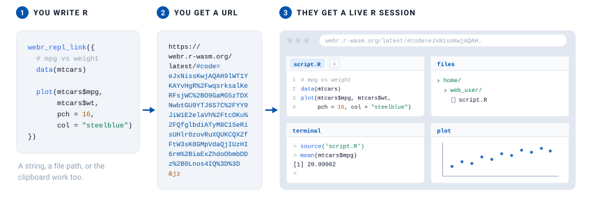

<!-- README.md is generated from README.qmd. Please edit that file -->

# livelink <picture><source media="(prefers-color-scheme: dark)" srcset="man/figures/livelink-logo-dark-animated.svg"></picture>

<!-- badges: start -->

[](https://github.com/coatless-rpkg/livelink/actions/workflows/R-CMD-check.yaml)
[](https://CRAN.R-project.org/package=livelink)
[](https://lifecycle.r-lib.org/articles/stages.html#experimental)
<!-- badges: end -->

Create shareable links for R code in WebAssembly (WASM) environments:
webR for a full R REPL, and Shinylive for R and Python Shiny apps.

There is no server and nothing to upload. Your code is compressed and
encoded *into the URL itself*. Everything after the `#` is a URL
fragment, which browsers never send anywhere, so the recipient clicks
the link and lands in a running R session in their browser.

<picture><source media="(prefers-color-scheme: dark)" srcset="man/figures/hero-dark.svg"></picture>

Full documentation is at
<https://r-pkg.thecoatlessprofessor.com/livelink/>.

## Installation

You can install `livelink` from CRAN with:

``` r
install.packages("livelink")
```

Or install the development version from GitHub with:

``` r
# install.packages("remotes")
remotes::install_github("coatless-rpkg/livelink")
```

### Requirements

- R ≥ 4.1.0
- An internet connection (the links run in a browser)
- A modern web browser with WebAssembly support

## Quick Start

The examples below create and decode links for R code, R Shiny apps, and
Python Shiny apps.

### webR links

Share R code that runs in the browser.

Pass the code straight in, with no quotes and no escaping, just braces:

``` r
library(livelink)

link <- webr_repl_link({
  data(mtcars)
  plot(mtcars$mpg, mtcars$wt)
})

print(link)
#> 
#> ── webR Link ──
#> 
#> <https://webr.r-wasm.org/latest/#code=eJyb2LwkLzE3dUVxclFmQYle0JKCxJKM7foZ%2Bbmp%2BuWpSfGlxalF%2BnDJktSKkpsaKYkliRq5JcmJRcWaXAU5%2BSVQjkpuQbqOApRdXqIJAPpaJJY%3D&mz>
#> 
#> File: 'script.R' → '/home/web_user/script.R'
#> Version: "latest"
#> Autorun: FALSE
```

Strings, file paths, and the clipboard work too, if the code is already
somewhere else:

``` r
webr_repl_link("plot(1:10)")     # a string
webr_repl_link("analysis.R")     # a file on disk
webr_repl_link()                 # whatever is on your clipboard
```

### Shinylive apps

Share a Shiny application the same way:

``` r
# Simple Shiny app
app_code <- '
library(shiny)

ui <- fluidPage(
  titlePanel("Hello Shinylive!"),
  sidebarLayout(
    sidebarPanel(
      sliderInput("n", "Number of points:", 10, 100, 50)
    ),
    mainPanel(
      plotOutput("plot")
    )
  )
)

server <- function(input, output) {
  output$plot <- renderPlot({
    plot(rnorm(input$n), main = paste("Random points:", input$n))
  })
}

shinyApp(ui = ui, server = server)
'

# Create app link
app_link <- shinylive_r_link(app_code, mode = "app")
print(app_link)
#> 
#> ── Shinylive R App ──
#> 
#> <https://shinylive.io/r/app/#code=NobwRAdghgtgpmAXGKAHVA6ASmANGAYwHsIAXOMpMAHQgBsBLAIwCcoWBPACgGcALBhA4BKWrQCuDAAQAeALRSAZnUkATAApQA5nC60pU0g1J04miHDp6wACUt0iUgMoChjAG5wAhNTDDc+lI8DKpwTOwAMlAcROKkehAGBsGh4SzmlglJSTyMoSwAkhCocdYQvrhSvgBy4jBMcCxSRIpSqESCpDyIFVIAjAAMlYNDUgCsA6KJSf6BBjBQghlWc0moDqQA8nEl8b7rRKS+U9knUlNTtDyNnk3ySuIQBEYkXIK7lbGku8JSIIFfXYAEgOpFkChYFHy6g2XH+0wMoK4LAgRBYMDexTiQIg-ikC0EUgAvG0oDxyNYsFAIKoiDA2h0yN1eu9sbizgBfKYcsQQfiCDgAQXQXEkxKkkkq1xYt3F0tuUzwYFIHFQCGQ5AAHqQwByALpAA>
#> 
#> Files (1):
#> 'app.R'
#> 
#> Engine: "R"
#> Mode: "app"
```

## Multi-file Projects

A project can hold several files. Write each one as R, in braces, and
mix in a string for anything that is not code.

``` r
library(livelink)

project <- webr_repl_project(list(
  "analysis.R" = {
    source("utils.R")
    create_plot(mtcars)
  },
  "utils.R" = {
    create_plot <- function(data) {
      plot(data$mpg, data$wt, main = "MPG vs Weight")
    }
  },
  "README.md" = "# Car Analysis\nAnalysis of the mtcars dataset."
), autorun_files = "analysis.R")

print(project)
#> 
#> ── webR Project ──
#> 
#> <https://webr.r-wasm.org/latest/#code=eJxdj01qAkEQRvdzimKSwAyYmQskC0kkKyEIIUspx9JpmO4euqv9QVzpDbyCIHoA0bWn8DaOraJYq6K%2Bot6rxXypUNIGFRZjK2zSWpbI%2BT7NtaR0SJ22s2TSh5hpxMc3q53JKAodi6KahnGQGUKmdllojiRnaGy8QsfaOHWYecjquuwJ2yfCLfPn%2Fx6Owcc79JzKWGgVdZExhkkAVXnSefAqy34NfDfkGkgUCj4hbP7%2BwMDCP4l%2BzpXg9GKxbjXq381GIrveY%2FfkcU%2B9SfICX2igfv0%2FuDWge8A5weVTD7fEyQlXE38U&mza>
#> 
#> Files (3):
#> 'analysis.R' → '/home/web_user/analysis.R' (autorun)
#> 'utils.R' → '/home/web_user/utils.R'
#> 'README.md' → '/home/web_user/README.md'
#> Version: "latest"
```

Write the `list()` inside the call. If you assign it to a variable
first, R runs the braces before livelink ever sees them.

## Educational content

Create paired exercise and solution links:

``` r
exercise <- "
# Exercise: Calculate summary statistics
# TODO: Calculate the mean and median of mtcars$mpg
mean_mpg <- # YOUR CODE HERE
median_mpg <- # YOUR CODE HERE

cat('Mean MPG:', mean_mpg, '\\n')
cat('Median MPG:', median_mpg, '\\n')
"

solution <- "
# Solution: Calculate summary statistics
mean_mpg <- mean(mtcars$mpg)
median_mpg <- median(mtcars$mpg)

cat('Mean MPG:', mean_mpg, '\\n')
cat('Median MPG:', median_mpg, '\\n')
"

exercise_links <- webr_repl_exercise(exercise, solution, "mpg_stats")

# Share exercise with students
student_link <- repl_urls(exercise_links$exercise)

# Keep solution for instructor
solution_link <- repl_urls(exercise_links$solution)
```

## Batch processing

Turn a whole directory into links in one call:

``` r
# Process all R files in a directory
links <- webr_repl_directory("./examples/",
                            autorun = TRUE,
                            panels = c("editor", "plot"))

# Process Shiny app directories
shiny_links <- shinylive_directory("./shiny_apps/", 
                                  engine = "r", 
                                  mode = "app")
```

## Link preview and decoding

Inspect a webR link in memory, without writing any files:

``` r
# Preview a link without downloading
existing_url <- "https://webr.r-wasm.org/latest/#code=eJyb2LwkLzE3dUVxclFmQYle0JKCxJKM7foZ%2Bbmp%2BuWpSfGlxalF%2BnDJlMSSxCNcBTn5JRqGVoYGmgBEFxiu"
preview <- preview_webr_link(existing_url)
print(preview)
#> 
#> ── webR Link Preview ──
#> 
#> URL:
#> <https://webr.r-wasm.org/latest/#code=eJyb2LwkLzE3dUVxclFmQYle0JKCxJKM7foZ%2Bbmp%2BuWpSfGlxalF%2BnDJlMSSxCNcBTn5JRqGVoYGmgBEFxiu>
#> 
#> Files: 1
#> Total size: 10 bytes
#> Version: "latest"
#> Encoding: "mz"
#> 
#> 'script.R' (10 bytes)
#> 
#> Use print(preview, show_content = TRUE) to see file contents
```

Once you trust a link, decode it to write the files to disk:

``` r
# Extract files to local directory
result <- decode_webr_link(existing_url, output_dir = "./extracted")
print(result)

# Batch decode multiple URLs
urls <- c(url1, url2, url3)
results <- decode_webr_link(urls, output_dir = "./all_extracted")
```

## Python Shiny support

Python Shiny apps work exactly like the R ones:

``` r
py_app <- '
from shiny import App, render, ui

app_ui = ui.page_fluid(
    ui.h2("Hello from Python Shiny!"),
    ui.input_slider("n", "N", 0, 100, 20),
    ui.output_text_verbatim("result"),
)

def server(input, output, session):
    @output
    @render.text
    def result():
        return f"n*2 is {input.n() * 2}"

app = App(app_ui, server)
'

py_link <- shinylive_py_link(py_app, mode = "app")
print(py_link)
#> 
#> ── Shinylive Python App ──
#> 
#> <https://shinylive.io/py/app/#code=NobwRAdghgtgpmAXGKAHVA6VBPMAaMAYwHsIAXOcpMAHQgDMAnYmAAgGcALASwm1e4xUxRmVYBBdHlaNKAEziNpAV2506aVAH1VrALytVWKAHM4W+gBtVcgBR1Wjw9wycATPbAAJOJcvFWJhZWAAVsMk5SVgBlHj4AQhowAEo8BycjXlRlMi12S24FRk8IJOkkgDky1gAGaQBGGrrWNxrU9McjYhzs3IoAD1yAN0UAIygyQU9ZdmVLMiT2iGT1CAV6DkUR4qyc6W6yXul2OHZ2blJkxA7WAAED3pvb2TXFDAGFiCdWdZlTubItiuN2+sjIykYX3oSQgACo3AJ2KwQLsyBgIEDWLCWgBfJKrTT6CToWyaHTcY5bRQrCD4MBkbCoBDID5gHEAXSAA>
#> 
#> Files (1):
#> 'app.py'
#> 
#> Engine: "Python"
#> Mode: "app"
```

## License

AGPL (\>= 3)

## Acknowledgements

Thanks to [George Stagg](https://github.com/georgestagg) for
[webR](https://docs.r-wasm.org/webr/latest/) and its browser REPL, and
to [Winston Chang](https://github.com/wch) for the
[Shinylive](https://github.com/posit-dev/shinylive) share-URL feature.
livelink writes to the share formats they built and opens in the
runtimes they maintain, so it is mostly a friendly wrapper around a good
idea they had. [Pyodide](https://github.com/pyodide/pyodide) is its own
remarkable project, and it is what runs the Python side of Shinylive.
Thanks, too, to [`peeky`](https://github.com/coatless-rpkg/peeky) for
stating the other half of this idea plainly enough that the feature
became obvious. And for turning a braced R expression into clean,
verbatim source, livelink borrows
[reprex](https://reprex.tidyverse.org/)’s
[`stringify_expression()`](https://github.com/tidyverse/reprex/blob/main/R/stringify_expression.R),
copyright the reprex authors and [MIT
licensed](https://github.com/tidyverse/reprex/blob/main/LICENSE.md).
livelink is one step, and webrarian is the next, already taking shape.
