<!-- README.md is generated from README.qmd. Please edit that file -->

```{r, include = FALSE}
knitr::opts_chunk$set(
  collapse = TRUE,
  comment = "#>",
  fig.path = "man/figures/README-",
  out.width = "100%"
)
```

# livelink   

<!-- badges: start -->
[](https://github.com/coatless-rpkg/livelink/actions/workflows/R-CMD-check.yaml)
[](https://CRAN.R-project.org/package=livelink)
[](https://app.codecov.io/gh/coatless-rpkg/livelink)
[](https://lifecycle.r-lib.org/articles/stages.html#experimental)
<!-- badges: end -->

Create shareable links for R code in WebAssembly (WASM) REPL environments like
webR and for R and Python Shiny applications using Shinylive.

Full documentation is at
<https://r-pkg.thecoatlessprofessor.com/livelink/>.

## Installation

You can install `livelink` from CRAN with:

```r
install.packages("livelink")
```

Or install the development version from GitHub with:

```r
# install.packages("remotes")
remotes::install_github("coatless-rpkg/livelink")
```


### Requirements

-   R ≥ 4.0.0
-   Internet connection (links run in browser)
-   Modern web browser with WebAssembly support

## Quick Start

We'll cover how to create links and decode them for R code, R Shiny applications, and Python Shiny applications using `livelink`.

### WebR Links

Share R code that runs in the browser:

```{r}
#| label: webr-example
library(livelink)

# Some R code to share
code <- "1 + 1"

# Create shareable link that runs in webR
link <- webr_repl_link(code)
print(link)
```

### Shinylive Apps

Create shareable Shiny applications:

```{r}
#| label: r-shinylive-example
# Simple Shiny app
app_code <- '
library(shiny)

ui <- fluidPage(
  titlePanel("Hello Shinylive!"),
  sidebarLayout(
    sidebarPanel(
      sliderInput("n", "Number of points:", 10, 100, 50)
    ),
    mainPanel(
      plotOutput("plot")
    )
  )
)

server <- function(input, output) {
  output$plot <- renderPlot({
    plot(rnorm(input$n), main = paste("Random points:", input$n))
  })
}

shinyApp(ui = ui, server = server)
'

# Create app link
app_link <- shinylive_r_link(app_code, mode = "app")
print(app_link)
```

## Multi-file Projects

Share complex projects with multiple files:

```{r}
#| label: multifile-example
# Create a project with multiple files
files <- list(
"analysis.R" = "
source('utils.R')
data <- load_mtcars()
summary(data)
create_plot(data)
",
"utils.R" = "
load_mtcars <- function() {
  mtcars
}

create_plot <- function(data) {
  plot(data$mpg, data$wt, 
       main = 'MPG vs Weight',
       xlab = 'MPG', ylab = 'Weight')
}
",
"README.md" = "# Car Analysis\nAnalysis of the mtcars dataset."
)

# Create project with autorun
project <- webr_repl_project(files, autorun_files = "analysis.R")
print(project)
```

## Educational Content

Create exercise and solution pairs:

```{r}
#| label: exercise-example
exercise <- "
# Exercise: Calculate summary statistics
# TODO: Calculate the mean and median of mtcars$mpg
mean_mpg <- # YOUR CODE HERE
median_mpg <- # YOUR CODE HERE

cat('Mean MPG:', mean_mpg, '\\n')
cat('Median MPG:', median_mpg, '\\n')
"

solution <- "
# Solution: Calculate summary statistics
mean_mpg <- mean(mtcars$mpg)
median_mpg <- median(mtcars$mpg)

cat('Mean MPG:', mean_mpg, '\\n')
cat('Median MPG:', median_mpg, '\\n')
"

exercise_links <- webr_repl_exercise(exercise, solution, "mpg_stats")

# Share exercise with students
student_link <- repl_urls(exercise_links$exercise)

# Keep solution for instructor
solution_link <- repl_urls(exercise_links$solution)
```

## Batch Processing

Process entire directories:

```{r}
#| eval: false
#| label: batch-example
# Process all R files in a directory
links <- webr_repl_directory("./examples/",
                            autorun = TRUE,
                            panels = c("editor", "plot"))

# Process Shiny app directories
shiny_links <- shinylive_directory("./shiny_apps/", 
                                  engine = "r", 
                                  mode = "app")
```

## Link Preview and Decoding

Preview WebR links without decoding and saving files locally with:

```{r}
#| label: preview-example
# Preview a link without downloading
existing_url <- "https://webr.r-wasm.org/latest/#code=eJyb2LwkLzE3dUVxclFmQYle0JKCxJKM7foZ%2Bbmp%2BuWpSfGlxalF%2BnDJlMSSxCNcBTn5JRqGVoYGmgBEFxiu"
preview <- preview_webr_link(existing_url)
print(preview)
```

Decode existing links to extract files and save them locally:

```{r}
#| eval: false
#| label: decoding-example
# Extract files to local directory
result <- decode_webr_link(existing_url, output_dir = "./extracted")
print(result)

# Batch decode multiple URLs
urls <- c(url1, url2, url3)
results <- decode_webr_link(urls, output_dir = "./all_extracted")
```

## Python Shiny Support

Create Python Shiny applications:

```{r}
#| label:  python-example
py_app <- '
from shiny import App, render, ui

app_ui = ui.page_fluid(
    ui.h2("Hello from Python Shiny!"),
    ui.input_slider("n", "N", 0, 100, 20),
    ui.output_text_verbatim("result"),
)

def server(input, output, session):
    @output
    @render.text
    def result():
        return f"n*2 is {input.n() * 2}"

app = App(app_ui, server)
'

py_link <- shinylive_py_link(py_app, mode = "app")
print(py_link)
```


## License

AGPL (>= 3)

## Acknowledgements

Thanks to [George Stagg][stagg] for [webR][webr] and its browser REPL, and to
[Winston Chang][chang] for the [Shinylive][shinylive] share-URL feature.
livelink writes to the share formats they built and opens in the runtimes they
maintain, so it is mostly a friendly wrapper around a good idea they had.
[Pyodide][pyodide] is its own remarkable project, and it is what runs the
Python side of Shinylive. Thanks, too, to [`peeky`][peeky] for stating the
other half of this idea plainly enough that the feature became obvious. And
for turning a braced R expression into clean, verbatim source, livelink
borrows [reprex][reprex]'s [`stringify_expression()`][reprex-stringify],
copyright the reprex authors and [MIT licensed][reprex-license]. livelink is
one step, and [webrarian][webrarian] is the next, already taking shape.

[stagg]: https://github.com/georgestagg
[webr]: https://docs.r-wasm.org/webr/latest/
[chang]: https://github.com/wch
[shinylive]: https://github.com/posit-dev/shinylive
[pyodide]: https://github.com/pyodide/pyodide
[peeky]: https://github.com/coatless-rpkg/peeky
[reprex]: https://reprex.tidyverse.org/
[reprex-stringify]: https://github.com/tidyverse/reprex/blob/main/R/stringify_expression.R
[reprex-license]: https://github.com/tidyverse/reprex/blob/main/LICENSE.md
[webrarian]: https://github.com/coatless-rpkg/webrarian
