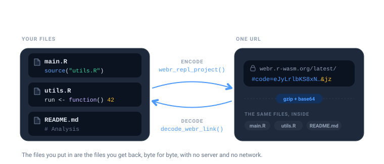
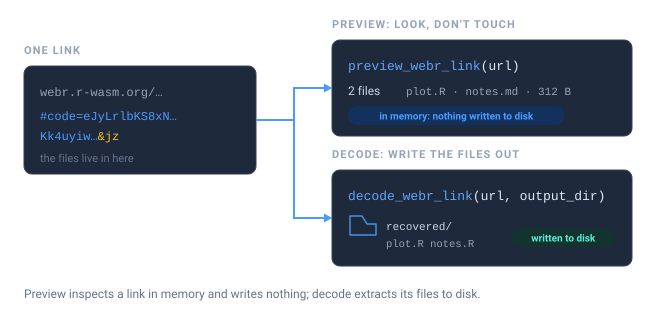
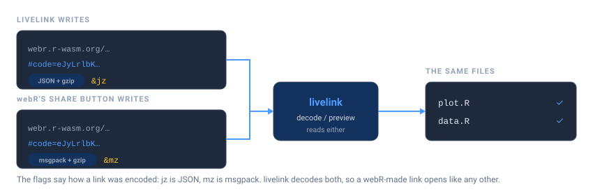

# Decoding and previewing links

A livelink URL is not a pointer to a file on a server. The files *are*
the URL – compressed, encoded, and carried in the fragment after `#`.
Nothing is uploaded anywhere, which is what makes these links work
offline and forever.

That has a useful consequence: any link can be turned back into the
files it came from, by anyone, with no network access.



## Look before you leap

Someone sends you a link. Before you let it write anything to your disk,
you can inspect it. There are two ways to open a link, and they differ
in exactly one way: whether anything touches your filesystem.



[`preview_webr_link()`](https://r-pkg.thecoatlessprofessor.com/livelink/reference/preview_webr_link.md)
decodes the URL in memory and tells you what is inside, without creating
a single file.

``` r

url <- as.character(webr_repl_link("hist(rnorm(100))", filename = "plot.R"))

preview <- preview_webr_link(url)
preview
#> 
#> ── webR Link Preview ──
#> 
#> URL:
#> <https://webr.r-wasm.org/latest/#code=eJyb2LwkLzE3dVlBTn6JXtCSgsSSjK36Gfm5qfrlqUnxpcWpRfpQqZLUipINGZnFJRpFeflFuRqGBgaamgBhqxlI&mz>
#> 
#> Files: 1
#> Total size: 16 bytes
#> Version: "latest"
#> Encoding: "mz"
#> 
#> 'plot.R' (16 bytes)
#> 
#> Use print(preview, show_content = TRUE) to see file contents
```

The preview object carries the details, so you can query it rather than
read it:

``` r

preview$total_files
#> [1] 1
preview$files_data[[1]]$name
#> [1] "plot.R"
```

To see the actual code, ask for it:

``` r

print(preview, show_content = TRUE)
#> 
#> ── webR Link Preview ──
#> 
#> URL:
#> <https://webr.r-wasm.org/latest/#code=eJyb2LwkLzE3dVlBTn6JXtCSgsSSjK36Gfm5qfrlqUnxpcWpRfpQqZLUipINGZnFJRpFeflFuRqGBgaamgBhqxlI&mz>
#> 
#> Files: 1
#> Total size: 16 bytes
#> Version: "latest"
#> Encoding: "mz"
#> 
#> 'plot.R' (16 bytes)
#>   hist(rnorm(100))
```

This is the honest way to open a link from a stranger. You get to read
the code before you decide whether to run it.

## Extracting the files

Once you are satisfied,
[`decode_webr_link()`](https://r-pkg.thecoatlessprofessor.com/livelink/reference/decode_webr_link.md)
writes the files out.

``` r

out <- file.path(tempdir(), "recovered")

result <- decode_webr_link(url, output_dir = out)
#> Decompressing webR data...
#> Parsing file data...
#> Created directory: '/tmp/RtmpPCiu4M/recovered/webr_f40f99ea'
#> Decoding 1 file...
#> 'plot.R' (16 bytes)
#> ✔ Successfully decoded 1 file to '/tmp/RtmpPCiu4M/recovered/webr_f40f99ea'
result
#> 
#> ── webR Decoded Files ──
#> 
#> Source:
#> <https://webr.r-wasm.org/latest/#code=eJyb2LwkLzE3dVlBTn6JXtCSgsSSjK36Gfm5qfrlqUnxpcWpRfpQqZLUipINGZnFJRpFeflFuRqGBgaamgBhqxlI&mz>
#> Output: '/tmp/RtmpPCiu4M/recovered/webr_f40f99ea'
#> 
#> Files (1):
#> 'plot.R' (16 bytes)
#> 
#> Version: "latest"
#> Encoding: "mz"
```

By default it writes into a subdirectory of your session’s temporary
directory, so a stray call cannot litter your project. Pass `output_dir`
when you want the files somewhere permanent:

``` r

decode_webr_link(url, output_dir = "~/analysis", create_subdir = FALSE)
```

`create_subdir = FALSE` puts the files directly in `output_dir` instead
of nesting them under a hash-named folder.

Existing files are never clobbered silently. If a file is already there,
it is skipped and reported:

``` r

decode_webr_link(url, output_dir = out)
#> Decompressing webR data...
#> Parsing file data...
#> Decoding 1 file...
#> Warning: File already exists, skipping: 'plot.R'
#> ✔ Successfully decoded 0 files to '/tmp/RtmpPCiu4M/recovered/webr_f40f99ea'
#> 
#> 
#> ── webR Decoded Files ──
#> 
#> 
#> 
#> Source:
#> <https://webr.r-wasm.org/latest/#code=eJyb2LwkLzE3dVlBTn6JXtCSgsSSjK36Gfm5qfrlqUnxpcWpRfpQqZLUipINGZnFJRpFeflFuRqGBgaamgBhqxlI&mz>
#> 
#> Output: '/tmp/RtmpPCiu4M/recovered/webr_f40f99ea'
#> 
#> 
#> 
#> No files were saved due to the following issues:
#> 
#> ✖ 1 file already exists: plot.R
#> 
#> ℹ Use `overwrite = TRUE` to replace existing files
#> 
#> 
#> 
#> Version: "latest"
#> 
#> Encoding: "mz"
```

Pass `overwrite = TRUE` when replacing them is what you actually want.

## The round trip is lossless

What goes in comes back out, byte for byte, including multi-file
projects and non-ASCII text.

``` r

project <- list(
  "main.R"    = "source('utils.R')\nrun()",
  "utils.R"   = "run <- function() 42",
  "README.md" = "# Analysis\n\nWith an accent: café"
)

link <- webr_repl_project(project)

recovered_dir <- file.path(tempdir(), "roundtrip")
invisible(decode_webr_link(as.character(link), output_dir = recovered_dir))
#> Decompressing webR data...
#> Parsing file data...
#> Created directory: '/tmp/RtmpPCiu4M/roundtrip/webr_45b92ad7'
#> Decoding 3 files...
#> 'main.R' (23 bytes)
#> 'utils.R' (20 bytes)
#> 'README.md' (33 bytes)
#> ✔ Successfully decoded 3 files to '/tmp/RtmpPCiu4M/roundtrip/webr_45b92ad7'

files <- list.files(recovered_dir, recursive = TRUE, full.names = TRUE)
recovered <- setNames(
  lapply(files, function(f) paste(readLines(f, warn = FALSE), collapse = "\n")),
  basename(files)
)

identical(recovered[sort(names(recovered))], project[sort(names(project))])
#> [1] TRUE
```

## Shinylive links decode too

The same two functions exist for Shiny apps, and they work the same way.

``` r

app_url <- as.character(shinylive_r_link("library(shiny)\nshinyApp(fluidPage(), function(i, o) {})"))

preview_shinylive_link(app_url)
#> 
#> ── Shinylive R Preview ──
#> 
#> Source:
#> <https://shinylive.io/r/editor/#code=NobwRAdghgtgpmAXGKAHVA6ASmANGAYwHsIAXOMpMAGwEsAjAJykYE8AKAZwAtaJWAlAB0IPPqwCC6dgDNqAV1oATAApQA5nHYDcAAhnyIBUrRLtaeogN0gAvgLxhSrVAmTkAHqTC2AukA>
#> 
#> Files: 1
#> Total size: 55 bytes
#> Engine: "R"
#> Mode: "editor"
#> 
#> 'app.R' (text, 55 bytes)
#> 
#> Use print(preview, show_content = TRUE) to see file contents
```

``` r

decode_shinylive_link(app_url, output_dir = file.path(tempdir(), "app"))
#> Decompressing Shinylive data...
#> Parsing file data...
#> Created directory: '/tmp/RtmpPCiu4M/app/shinylive_6f92fb6e'
#> Decoding 1 file...
#> 'app.R' (text, 55 bytes)
#> ✔ Successfully decoded 1 file to '/tmp/RtmpPCiu4M/app/shinylive_6f92fb6e'
#> 
#> 
#> ── Shinylive R Decoded Files ──
#> 
#> 
#> 
#> Source:
#> <https://shinylive.io/r/editor/#code=NobwRAdghgtgpmAXGKAHVA6ASmANGAYwHsIAXOMpMAGwEsAjAJykYE8AKAZwAtaJWAlAB0IPPqwCC6dgDNqAV1oATAApQA5nHYDcAAhnyIBUrRLtaeogN0gAvgLxhSrVAmTkAHqTC2AukA>
#> 
#> Output: '/tmp/RtmpPCiu4M/app/shinylive_6f92fb6e'
#> 
#> 
#> 
#> Files (1):
#> 
#> 'app.R' (55 bytes)
#> 
#> 
#> 
#> Total size: 55 bytes
#> 
#> Mode: "editor"
```

Python apps are no different.
[`preview_shinylive_link()`](https://r-pkg.thecoatlessprofessor.com/livelink/reference/preview_shinylive_link.md)
reports the engine, so you can tell what you are looking at before you
extract it:

``` r

py_url <- as.character(shinylive_py_link("from shiny import App, ui"))

preview_shinylive_link(py_url)$engine
#> [1] "python"
```

## Many links at once

Both decoders accept a vector of URLs and return a batch object. This is
the useful shape for grading a stack of student submissions, or auditing
a set of links from a course page.

``` r

urls <- c(
  as.character(webr_repl_link("plot(1:10)", filename = "one.R")),
  as.character(webr_repl_link("hist(rnorm(50))", filename = "two.R"))
)

batch <- decode_webr_link(urls, output_dir = file.path(tempdir(), "batch"))
#> Processing 2 webR URLs...
#> 
#> 
#> 
#> ── Processing URL 1/2: script_01 
#> 
#> Decompressing webR data...
#> Parsing file data...
#> Created directory: '/tmp/RtmpPCiu4M/batch/script_01'
#> Decoding 1 file...
#> 'one.R' (10 bytes)
#> ✔ Successfully decoded 1 file to '/tmp/RtmpPCiu4M/batch/script_01'
#> 
#> 
#> 
#> ── Processing URL 2/2: script_02 
#> 
#> Decompressing webR data...
#> Parsing file data...
#> Created directory: '/tmp/RtmpPCiu4M/batch/script_02'
#> Decoding 1 file...
#> 'two.R' (15 bytes)
#> ✔ Successfully decoded 1 file to '/tmp/RtmpPCiu4M/batch/script_02'
#> 
#> ✔ Successfully processed 2/2 URLs
batch
#> 
#> ── webR Decoded Batch ──
#> 
#> Base directory: '/tmp/RtmpPCiu4M/batch'
#> Total URLs: 2
#> 
#> Successfully processed 2 URLs:
#> 'script_01': 1 file
#> '/tmp/RtmpPCiu4M/batch/script_01'
#> 
#> 'script_02': 1 file
#> '/tmp/RtmpPCiu4M/batch/script_02'
#> 
#> Summary: 2 total files saved across 2 URLs
```

Each URL gets its own subdirectory, so submissions cannot overwrite one
another.

## Reading links livelink did not create

webR’s own share dialog encodes files with **msgpack**, and so does
livelink, so a link from either writes the same format. Older livelink
links used JSON. The flags at the end of a URL say which is which: `mz`
is msgpack + gzip, `jz` is JSON + gzip, and `a` means autorun.



livelink reads all of them. A link produced by webR itself decodes
exactly like one produced here, and you do not have to know or care
which tool made it.

## Getting just the URL

Every object livelink returns (links, projects, previews, decoded
results) answers to
[`repl_urls()`](https://r-pkg.thecoatlessprofessor.com/livelink/reference/repl_urls.md):

``` r

repl_urls(preview)
#> [1] "https://webr.r-wasm.org/latest/#code=eJyb2LwkLzE3dVlBTn6JXtCSgsSSjK36Gfm5qfrlqUnxpcWpRfpQqZLUipINGZnFJRpFeflFuRqGBgaamgBhqxlI&mz"
repl_urls(batch)
#> [1] "https://webr.r-wasm.org/latest/#code=eJyb2LwkLzE3dWl%2BXqpe0JKCxJKMLfoZ%2Bbmp%2BuWpSfGlxalF%2BhCZktSKklUFOfklGoZWhgaaAJPuFgk%3D&mz"          
#> [2] "https://webr.r-wasm.org/latest/#code=eJyb2LwkLzE3dWlJeb5e0JKCxJKMLfoZ%2Bbmp%2BuWpSfGlxalF%2BhCZktSKkvUZmcUlGkV5%2BUW5GqYGmpoAFX0YTw%3D%3D&mz"
```

which is handy when you want to write links out to a file, or drop them
into a document, without unpicking the object.
