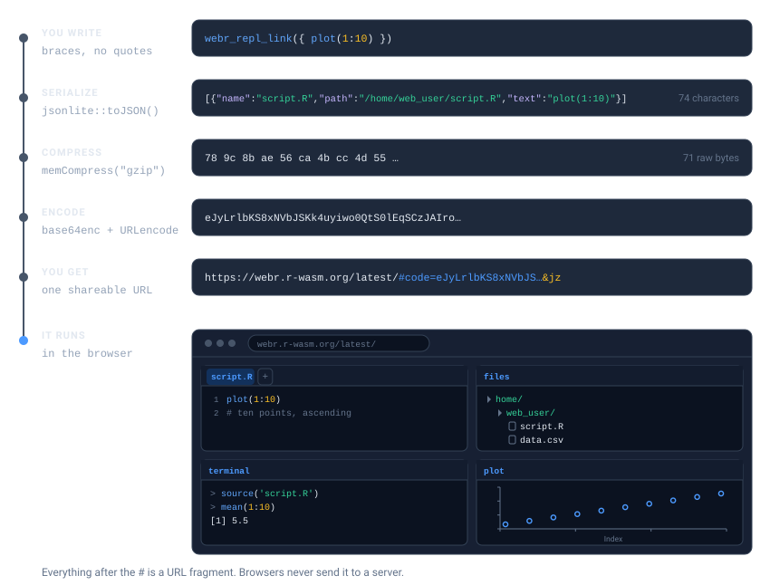
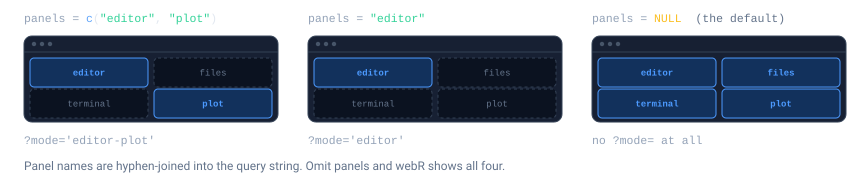
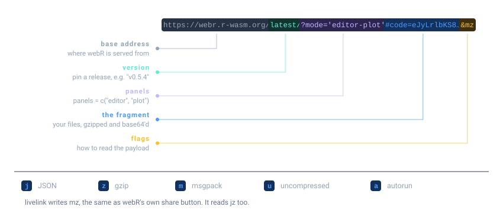

# Getting Started with livelink

## The idea

Sharing R code usually means asking someone to install something.
livelink asks nothing: it packs your code *into a URL*, and the
recipient clicks it and is looking at a running R session in their
browser.

There is no server and no upload. The code is compressed and encoded
into the part of the URL after the `#`, which browsers never send
anywhere. The link is the payload.



Two destinations are supported:

- **[webR](https://docs.r-wasm.org/webr/latest/)**: a full R console and
  editor in the browser.
- **[Shinylive](https://shiny.posit.co/py/get-started/shinylive.html)**:
  Shiny apps, R or Python, with no server.

## Your first link

Pass some code. Get a link.

``` r

webr_repl_link("plot(1:10)")
```

[Open in
webR](https://webr.r-wasm.org/latest/#code=eJyb2LwkLzE3dUVxclFmQYle0JKCxJKM7foZ%2Bbmp%2BuWpSfGlxalF%2BnDJktSKklUFOfklGoZWhgaaAC8DGLU%3D&mz)

In a rendered document like this one the object becomes a clickable
link, so you can open it right from the page. At an interactive console
it prints its details instead, and
[`as.character()`](https://rdrr.io/r/base/character.html) gives you the
bare URL string either way.

You can skip the quotes entirely and hand it a braced expression, which
is easier to write and lets your editor highlight the code:

``` r

webr_repl_link({
  data(mtcars)
  plot(mtcars$mpg, mtcars$wt)
})
```

[Open in
webR](https://webr.r-wasm.org/latest/#code=eJyb2LwkLzE3dUVxclFmQYle0JKCxJKM7foZ%2Bbmp%2BuWpSfGlxalF%2BnDJktSKkpsaKYkliRq5JcmJRcWaXAU5%2BSVQjkpuQbqOApRdXqIJAPpaJJY%3D&mz)

> **Comments and expression input**
>
> Expression input reconstructs your code from R’s *source references*.
> Those exist in an interactive session, but not when a document is
> knitted, so comments inside [`{ }`](https://rdrr.io/r/base/Paren.html)
> are dropped from the link when this vignette is rendered.
>
> If your code has comments worth keeping, pass it as a string or a file
> path, or write it as a chunk. See [Links inside
> documents](https://r-pkg.thecoatlessprofessor.com/livelink/articles/links-in-documents.md).

You can also point at a file:

``` r

script <- tempfile(fileext = ".R")
writeLines(c("# fit a model", "lm(mpg ~ wt, data = mtcars)"), script)

webr_repl_link(script)
```

[Open in
webR](https://webr.r-wasm.org/latest/#code=eJyb2LwkLzE3dUVxclFmQYle0JKCxJKM7foZ%2Bbmp%2BuWpSfGlxalF%2BnDJktSKkpuaygppmSUKiQq5%2BSmpOVw5uRq5BekKdQrlJToKKYkliQq2CrklyYlFxZoA9uUjdw%3D%3D&mz)

…or, in an interactive session, copy code to your clipboard and call
[`webr_repl_link()`](https://r-pkg.thecoatlessprofessor.com/livelink/reference/webr_repl_link.md)
with no arguments at all.

## Making it run on arrival

By default the recipient sees your code, ready to run. Set
`autorun = TRUE` and it runs the moment the page opens, which is right
for a demo and wrong for an exercise.

``` r

webr_repl_link("hist(rnorm(1000))", autorun = TRUE)
```

[Open in
webR](https://webr.r-wasm.org/latest/#code=eJyb2LIkLzE3dUVxclFmQYle0JKCxJKM7foZ%2Bbmp%2BuWpSfGlxalF%2BnDJktSKko0ZmcUlGkV5%2BUW5GoYGBgaamssTS0vyi0rzDgMA96Yfog%3D%3D&mza)

## Choosing what they see

webR opens with four panels: an **editor** for your code, a **terminal**
for the R console, a **files** browser, and a **plot** pane. `panels`
names the ones you want, and the rest never appear.



``` r

webr_repl_link("plot(1:10)", panels = c("editor", "plot"))
```

[Open in
webR](https://webr.r-wasm.org/latest/?mode='editor-plot'#code=eJyb2LwkLzE3dUVxclFmQYle0JKCxJKM7foZ%2Bbmp%2BuWpSfGlxalF%2BnDJktSKklUFOfklGoZWhgaaAC8DGLU%3D&mz)

The names are joined into the URL’s query string, `?mode='editor-plot'`,
so you can read a link and tell what the recipient will land on. Omit
`panels` and webR shows everything:

``` r

webr_repl_link("plot(1:10)")
```

[Open in
webR](https://webr.r-wasm.org/latest/#code=eJyb2LwkLzE3dUVxclFmQYle0JKCxJKM7foZ%2Bbmp%2BuWpSfGlxalF%2BnDJktSKklUFOfklGoZWhgaaAC8DGLU%3D&mz)

Trimming the panels is worth doing when the terminal would only invite
someone to wander off. [Teaching with
livelink](https://r-pkg.thecoatlessprofessor.com/livelink/articles/teaching.md)
leans on it.

## A Shiny app instead

[`shinylive_r_link()`](https://r-pkg.thecoatlessprofessor.com/livelink/reference/shinylive_r_link.md)
does the same for a Shiny application.

``` r

app <- "
library(shiny)
ui <- fluidPage(
  sliderInput('bins', 'Bins:', 1, 50, 30),
  plotOutput('hist')
)
server <- function(input, output) {
  output$hist <- renderPlot(hist(faithful$waiting, breaks = input$bins))
}
shinyApp(ui, server)
"

shinylive_r_link(app, mode = "app")
```

[Open in
Shinylive](https://shinylive.io/r/app/#code=NobwRAdghgtgpmAXGKAHVA6ASmANGAYwHsIAXOMpMAHQgBsBLAIwCcoWBPACgGcALBhA4BKWgFcGAAgA8AWkkAzOhIAmABSgBzOF1qTJPRirgsAkhFRjSXAORNBPG7kk2AQg8RPJARmcBWAAZnAGYA4Vw9SVQ6IlIAeStLaxsBHlIbUQhMnhMANxMZeQUxCAJSBhIuQSTnIkSrYUkQSLrSJIASVNJCyRYKYxY1GOsurgUoBlI+Yrp2gHcJ8ohNZ1Y4KABrHkkAXklqq3b7CB5hTIBfWn5BDgBBdC4JZxyWfJZMvDBSDlQEZHIAB6kMDnAC6QA)

`mode = "app"` shows the running application. `mode = "editor"` shows
the code beside it, which is what you want when the point is to teach.
Python apps work the same way through
[`shinylive_py_link()`](https://r-pkg.thecoatlessprofessor.com/livelink/reference/shinylive_py_link.md).

> **Why a string, and not a braced expression?**
>
> `shinylive_r_link({ ... })` does work. But a Shiny app is source text
> destined for *another* runtime, and putting
> [`library(shiny)`](https://shiny.posit.co/) inside braces makes it
> look like R code your own package runs: `R CMD check` scans vignettes
> for [`library()`](https://rdrr.io/r/base/library.html) calls and will
> report shiny as an undeclared dependency of livelink, which it is not.
>
> Braces are for R you want executed in webR. For a Shiny app, a string
> or a file path says what you mean.

## What a link actually looks like

Nothing here is magic, and the URL is readable if you know where to
look.



The flags at the end say how the payload was encoded: `m` for msgpack,
`j` for JSON, `z` for gzip, `u` for uncompressed, `a` for autorun.
livelink writes `mz`, the same format webR’s own share button writes. It
reads all of them, including the `jz` links earlier versions produced.

## Going the other way

Because the files live in the URL, any link can be turned back into
files, with no network access and no cooperation from a server.

``` r

url <- as.character(webr_repl_link("plot(1:10)"))

preview_webr_link(url)
#> 
#> ── webR Link Preview ──
#> 
#> URL:
#> <https://webr.r-wasm.org/latest/#code=eJyb2LwkLzE3dUVxclFmQYle0JKCxJKM7foZ%2Bbmp%2BuWpSfGlxalF%2BnDJktSKklUFOfklGoZWhgaaAC8DGLU%3D&mz>
#> 
#> Files: 1
#> Total size: 10 bytes
#> Version: "latest"
#> Encoding: "mz"
#> 
#> 'script.R' (10 bytes)
#> 
#> Use print(preview, show_content = TRUE) to see file contents
```

[`preview_webr_link()`](https://r-pkg.thecoatlessprofessor.com/livelink/reference/preview_webr_link.md)
inspects a link *without writing anything*, which is the sensible way to
open a link someone sent you.
[`decode_webr_link()`](https://r-pkg.thecoatlessprofessor.com/livelink/reference/decode_webr_link.md)
extracts the files once you have decided you trust them.

## Links inside a document

If you write in Quarto or R Markdown, a chunk can carry its own link.
Add `livelink: true` to an ordinary chunk and it keeps running exactly
as before, output and plots and all, with a link added underneath:

```` markdown
```{r}
#| livelink: true
#| autorun: true
data(mtcars)
plot(mtcars$mpg, mtcars$wt)   # a comment that survives
```
````

Your comments reach the link, which they do not when a
[`{ }`](https://rdrr.io/r/base/Paren.html) expression is knitted. [Links
inside
documents](https://r-pkg.thecoatlessprofessor.com/livelink/articles/links-in-documents.md)
covers this properly: the hook, the engine, every chunk option, and how
to set them once for a whole document.

## Where to next

- **[Multi-file projects and Shiny
  apps](https://r-pkg.thecoatlessprofessor.com/livelink/articles/webr-and-shinylive.md)**:
  projects, apps in R and Python, and whole directories.
- **[Decoding and previewing
  links](https://r-pkg.thecoatlessprofessor.com/livelink/articles/decoding-links.md)**:
  turning a link back into files, and inspecting one before you trust
  it.
- **[Links inside
  documents](https://r-pkg.thecoatlessprofessor.com/livelink/articles/links-in-documents.md)**:
  the chunk hook and the chunk engine, and every option they take.
- **[Teaching with
  livelink](https://r-pkg.thecoatlessprofessor.com/livelink/articles/teaching.md)**:
  exercise and solution pairs, whole course directories, and embedding
  links in notes.
