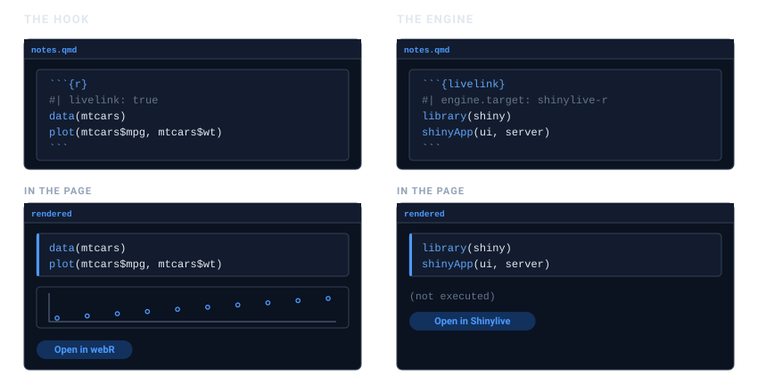
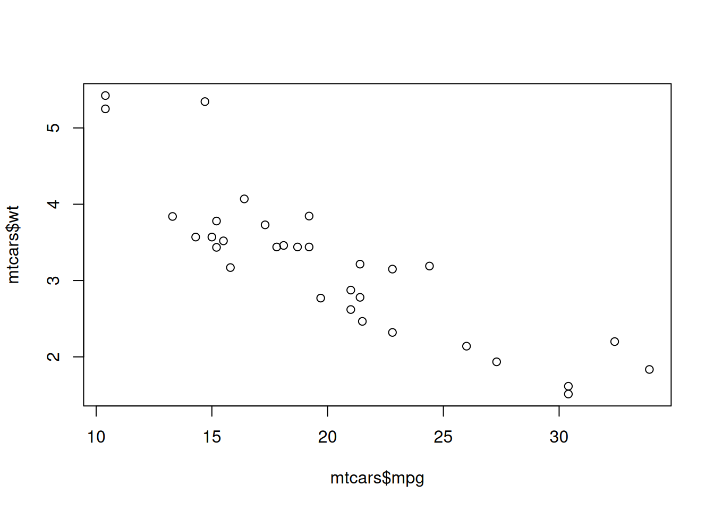
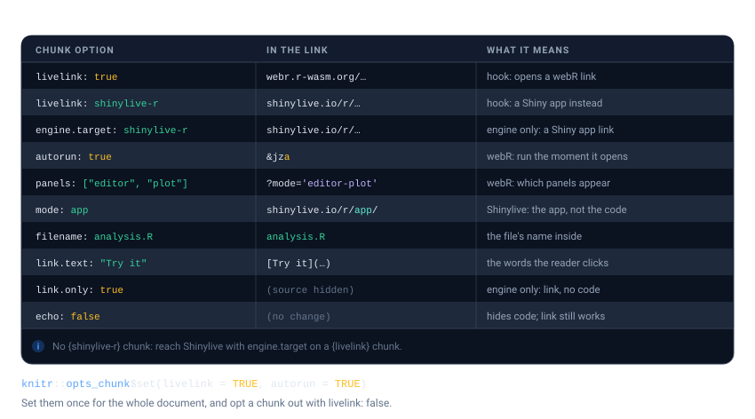

# Links inside documents

If you write in Quarto or R Markdown, you should not have to build a
link in one chunk and paste the URL into another. livelink plugs into
knitr, so a chunk can carry its own link.

There are two ways in, and the choice comes down to one question:
**should the code also run in your document?**



## The hook: output *and* a link

Add `livelink: true` to an ordinary `r` chunk. Nothing else changes. The
chunk runs, its output appears, and a link is added underneath.

```` markdown
```{r}
#| livelink: true
#| autorun: true
# Load the data
data(mtcars)
plot(mtcars$mpg, mtcars$wt)   # a comment your reader will actually see
```
````

That is a real chunk. Here it is, running in this very vignette. The
plot below is drawn by R, here, and the link under it opens the same
code in the browser:

``` r

# Load the data
data(mtcars)
plot(mtcars$mpg, mtcars$wt)   # a comment your reader will actually see
```



[Open in
webR](https://webr.r-wasm.org/latest/?mode='editor-plot'#code=eJw9ic0JwkAQRu%2Bp4oN4MCCmEU82IOPu4Ab2j9lZ1txtwB4C2oEFWIXdiBC8PN7j3W9LpMDPYmTKuj8umdS9RpcCj43Pp1pYxv9UvurH9jgkslDHsKTU%2FbANakjK0GWfdI1NyJcdVm86AOhBMCkEjoo5VYEwWRa0yXuQ0UrezyjMD6qapMb3F9lVPYA%3D&mza)

This is usually what you want. Readers see the result, and can still go
and poke at it.

## The engine: a link, and no execution

Sometimes the code must *not* run in your document: a Shiny app,
something needing a package you have not installed, something slow. Use
a ```` ```{livelink} ```` chunk. The code is displayed, a link is
produced, and nothing is executed.

```` markdown
```{livelink}
#| engine.target: shinylive-r
#| mode: app
library(shiny)
shinyApp(fluidPage(sliderInput("n", "n", 1, 100, 50)), function(input, output) {})
```
````

That is how the Shiny examples in these vignettes are built. livelink
does not depend on shiny, and does not want to.

> **There is no `{shinylive-r}` chunk**
>
> It is tempting to want a ```` ```{shinylive-r} ```` chunk to match
> Shinylive’s own naming. knitr cannot provide one: its chunk syntax
> forbids a hyphen in an engine name, and in Quarto a `{shinylive-r}`
> cell is handed to the Shinylive extension, not to knitr. Name
> Shinylive through `engine.target` on a
> [livelink](https://r-pkg.thecoatlessprofessor.com/livelink/) chunk
> instead, as above.

## Chunk options

Each option changes one part of the link. The figure below reads left to
right: the option you set, the piece of the URL it changes, and what
that means for your reader. The full list is at the end of this article,
in [Every chunk option](#every-chunk-option).



### `echo` does not do what you might think

It is natural to assume the code must be visible for a link to be made.
It does not.

`echo` controls whether the **source is displayed in your page**. The
link is built from the chunk’s source, which knitr hands over
regardless. So `echo: false` gives you a working link whose code you
simply cannot see in the document:

    #> [1] 20.09062

[This link works, though you cannot see its code
above](https://webr.r-wasm.org/latest/#code=eJw9yb0NwkAMBtBVLEEBDTcAW7AAMieLszg7p%2FPHT88E7JCCDTJLtkmqvPb9vqOzyT9y14bTZWyMMqUymKS33K7PkJ62hHwwn03YD4bMPfbW7kci2hGKBuXBTBwU0FoJnV9Sg9TXFarqjwXhFysk&mz)

The code, and that comment, are both in the link. Follow it and look.

`eval: false` is the other half: the chunk is shown but not run, which
makes an `r` chunk behave rather like the engine.

## Setting options once

Chunk options are knitr options, so `opts_chunk` sets them for the whole
document:

``` r

knitr::opts_chunk$set(livelink = TRUE, autorun = TRUE)
```

Every subsequent `r` chunk then carries a link, and you opt one out
where you do not want it:

```` markdown
```{r}
#| livelink: false
# scaffolding the reader does not need a link for
setup_the_data()
```
````

This is worth doing in course notes, where nearly every chunk should be
something a student can open and edit.

## Why not a braced expression?

`webr_repl_link({ ... })` looks like it ought to work in a document. It
does, but it loses your comments.

knitr runs every chunk through
[`evaluate::evaluate()`](https://r-pkg.thecoatlessprofessor.com/livelink/articles/evaluate.r-lib.org/reference/evaluate.md),
which strips **source references** as it goes, `keep.source` or not.
Comments live only in those references, so a
[`{ }`](https://rdrr.io/r/base/Paren.html) expression inside a knitted
document reaches livelink with its comments already gone. There is no
option that changes this: the source is discarded before livelink ever
sees the expression, so nothing livelink could do would bring the
comments back.

Both the hook and the engine sidestep the problem entirely. They are
handed the chunk’s **raw source text**, comments and all, which is the
one route by which a comment reaches a link from a rendered document.
That is the whole reason they exist.

Use braces in an interactive session, where source references are
present. Inside a document, use a chunk.

## Every chunk option

Keep this section as a reference to return to. It is the figure above in
full, one row per option: the option you set, the part of the link it
changes, and what that means for your reader.

| Option | In the link | What it means |
|----|----|----|
| `livelink: true` | `webr.r-wasm.org/…` | hook only: turn an `r` chunk into a webR link |
| `livelink: shinylive-r` | `shinylive.io/r/…` | hook only: a Shiny app instead of a REPL (also `"webr"`, `"shinylive-py"`) |
| `engine.target: shinylive-r` | `shinylive.io/r/…` | engine only: the same targets, for a [livelink](https://r-pkg.thecoatlessprofessor.com/livelink/) chunk |
| `autorun: true` | `&mza` (the `a` flag) | webR only: run the code the moment the link opens |
| `panels: ["editor", "plot"]` | `?mode='editor-plot'` | webR only: which panels appear |
| `mode: app` | `shinylive.io/r/app/` | Shinylive only: the running app, not the code |
| `filename: analysis.R` | `analysis.R` | the file’s name inside the environment |
| `link.text: "Try it"` | `[Try it](…)` | the words the reader clicks |
| `link.only: true` | *(source hidden)* | engine only: emit the link without showing the source |
| `echo: false` | *(no change)* | hides the code in the page; the link still works |

Any of these can be set once for a whole document, as [Setting options
once](#setting-options-once) shows.
