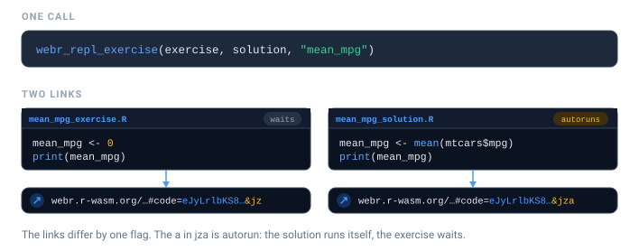

# Teaching with livelink

The hardest part of teaching R is not R. It is the twenty minutes at the
start of a workshop spent installing R, then RStudio, then a package
that fails to compile on one student’s laptop.

livelink sidesteps that. A link opens a working R session in the
browser, with your code already in the editor. Nothing to install,
nothing to configure, and it works on a school Chromebook.

## Exercise and solution pairs

[`webr_repl_exercise()`](https://r-pkg.thecoatlessprofessor.com/livelink/reference/webr_repl_exercise.md)
is built for the most common teaching shape: give students a scaffold
with the answer removed, and keep the worked solution behind a second
link.



``` r

exercise <- "
# Exercise: what is the mean mpg of the cars in mtcars?
# Replace the 0 below with your answer.

mean_mpg <- 0
print(mean_mpg)
"

solution <- "
# Solution
mean_mpg <- mean(mtcars$mpg)
print(mean_mpg)
"

links <- webr_repl_exercise(exercise, solution, "mean_mpg")
links
```

- [exercise](https://webr.r-wasm.org/latest/#code=eJxtjkEKwjAQRa8yxI2Ctl0XwZUX6NZISctoAs0kJFNSEe9uUuzO3cz7%2F8G%2FvQUpi6IVFhX11j97XDCMJmLViaPwinUOa%2B0s1gmHfo4Y6v9dxoVzV9IOrj%2FeQtKKwURgjVA0yBq4x%2FqPKkQwGXG5LkXs0E9qxDVuYMDJJUiGNbzcHEBRTBgqSZK2CXA%2BQSPJB0O83%2BBBkvjcvx7STSE%3D&jz)
- [solution](https://webr.r-wasm.org/latest/#code=eJxtzMEKwjAMxvFXKdHDBLX34VPo0UqpEtzApiVNUBDf3Qy2227hnx%2Ff9QuUMkIPGRPFXJ%2BxlZfKWOh4hj3UJIM9%2FVAy%2BjfeozZkv24FP2I20MZd5h5ooe50cNPdZXkkbltLu0CVR5JuMRZsJqkUVoJeWPF3%2BwNT1joH&jza)

These are written as plain strings on purpose. An exercise is mostly its
instructions, and those live in comments, so a braced
[`{ }`](https://rdrr.io/r/base/Paren.html) expression would drop them
the moment these notes are knitted. [Links inside
documents](https://r-pkg.thecoatlessprofessor.com/livelink/articles/links-in-documents.html#why-not-a-braced-expression)
explains why.

The two links differ in one deliberate way: the solution **autoruns**
and the exercise does not. Students landing on the exercise see the code
sitting there waiting for them. Students landing on the solution see the
answer already computed.

``` r

links$exercise$autorun
#> [1] FALSE
links$solution$autorun
#> [1] TRUE
```

Hand out the exercise link in class, and hold the solution link back
until afterwards, or put it behind a collapsed callout in your notes.

``` r

repl_urls(links)
#>                                                                                                                                                                                                                                                                       exercise 
#> "https://webr.r-wasm.org/latest/#code=eJxtjkEKwjAQRa8yxI2Ctl0XwZUX6NZISctoAs0kJFNSEe9uUuzO3cz7%2F8G%2FvQUpi6IVFhX11j97XDCMJmLViaPwinUOa%2B0s1gmHfo4Y6v9dxoVzV9IOrj%2FeQtKKwURgjVA0yBq4x%2FqPKkQwGXG5LkXs0E9qxDVuYMDJJUiGNbzcHEBRTBgqSZK2CXA%2BQSPJB0O83%2BBBkvjcvx7STSE%3D&jz" 
#>                                                                                                                                                                                                                                                                       solution 
#>                                                      "https://webr.r-wasm.org/latest/#code=eJxtzMEKwjAMxvFXKdHDBLX34VPo0UqpEtzApiVNUBDf3Qy2227hnx%2Ff9QuUMkIPGRPFXJ%2BxlZfKWOh4hj3UJIM9%2FVAy%2BjfeozZkv24FP2I20MZd5h5ooe50cNPdZXkkbltLu0CVR5JuMRZsJqkUVoJeWPF3%2BwNT1joH&jza"
```

## Choosing what students see

A full webR session shows an editor, a plot pane, a file browser, and a
terminal. For a first-year class that is a lot of surface area, and the
terminal in particular invites students to wander off.

`panels` controls which of them appear.


``` r

# A focused exercise: just write code and see the plot
webr_repl_link("plot(1:10)", panels = c("editor", "plot"))
```

[Open in
webR](https://webr.r-wasm.org/latest/?mode='editor-plot'#code=eJyLrlbKS8xNVbJSKk4uyiwo0QtS0lEqSCzJAIroZ%2BTnpuqXpybFlxanFukjKShJrSgBKijIyS%2FRMLQyNNBUqo0FAJecF%2Fo%3D&jz)

``` r

# The full environment, for a project week
webr_repl_link(code, panels = c("editor", "plot", "files", "terminal"))
```

For a lecture demo, where students should see the *result* and not the
machinery, combine `autorun` with a plot-only view:

``` r

webr_repl_link(
  "hist(rnorm(1000), col = 'steelblue', main = 'The central limit theorem, again')",
  autorun = TRUE,
  panels  = "plot"
)
```

[Open in
webR](https://webr.r-wasm.org/latest/?mode='plot'#code=eJxNzEsKwjAURuGtXDJpC8HEacFNiDMRScOPCeRRbm5QEPdunDk9fJzrWxWXoVbVPMddDmel1e4kjGJCzTBPbPfewOYPCF4yQIhNZi6V83y01i6afE10oqkJkLbUMWnKLpZfuwSQRxF2iVLMUUgCKiNrco9hpmWMXZfKvahVuONz%2BwIbnTR%2B&jza)

Only `.R` files can autorun. Ask for it on something else and livelink
tells you rather than quietly producing a link that does nothing:

``` r

webr_repl_link("some data", filename = "data.csv", autorun = TRUE)
#> Warning: `autorun` was ignored
#> ! Only R files can be auto-executed, but 'data.csv' is not one.
#> ℹ Give `filename` a `.R` extension to enable autorun.
```

[Open in
webR](https://webr.r-wasm.org/latest/#code=eJyLrlbKS8xNVbJSSkksSdRLLi5T0lEqSCzJAIroZ%2BTnpuqXpybFlxanFukjKShJrSgBKigGyiuAhJVqYwGBRBiK&jz)

## A whole folder of scripts

Course material tends to live as a directory of scripts, and livelink
gives you two ways to turn that folder into links. Which you want comes
down to a single question: are the scripts **independent**, or **parts
of one thing**?

[`webr_repl_directory()`](https://r-pkg.thecoatlessprofessor.com/livelink/reference/webr_repl_directory.md)
gives each script *its own* link. That is the right call for a folder of
standalone exercises: one link per file, each opening just that script.


``` r

# A small course directory
course <- file.path(tempdir(), "course")
dir.create(course, showWarnings = FALSE)
writeLines("plot(1:10)",           file.path(course, "01-plotting.R"))
writeLines("mean(mtcars$mpg)",     file.path(course, "02-summaries.R"))
writeLines("lm(mpg ~ wt, mtcars)", file.path(course, "03-models.R"))

links <- webr_repl_directory(course, panels = c("editor", "plot"))
#> ✔ Found 3 files matching pattern "\\.R$"
#> ℹ Processing files in '/tmp/RtmpQ67sjt/course'...
#> ✔ Successfully created 3 WebR links
links
```

- [01-plotting.R](https://webr.r-wasm.org/latest/?mode='editor-plot'#code=eJyLrlbKS8xNVbJSMjDULcjJLynJzEvXC1LSUSpILMkACutn5Oem6penJsWXFqcW6aOrKkmtKAGqAolpGFoZGmgq1cYCAIPDGs4%3D&jz)
- [02-summaries.R](https://webr.r-wasm.org/latest/?mode='editor-plot'#code=eJyLrlbKS8xNVbJSMjDSLS7NzU0sykwt1gtS0lEqSCzJAIrrZ%2BTnpuqXpybFlxanFuljKCtJrSgBKstNTczTyC1JTiwqVsktSNdUqo0FAHt7HqI%3D&jz)
- [03-models.R](https://webr.r-wasm.org/latest/?mode='editor-plot'#code=eJyLrlbKS8xNVbJSMjDWzc1PSc0p1gtS0lEqSCzJAArqZ%2BTnpuqXpybFlxanFumjqilJrSgBqsnJ1cgtSFeoUygv0VHILUlOLCrWVKqNBQAVDx0J&jz)

The result is named by file, so it drops straight into a table of
contents:

``` r

urls <- repl_urls(links)
cat(sprintf("- [%s](%s)", names(urls), urls), sep = "\n")
#> - [01-plotting.R](https://webr.r-wasm.org/latest/?mode='editor-plot'#code=eJyLrlbKS8xNVbJSMjDULcjJLynJzEvXC1LSUSpILMkACutn5Oem6penJsWXFqcW6aOrKkmtKAGqAolpGFoZGmgq1cYCAIPDGs4%3D&jz)
#> - [02-summaries.R](https://webr.r-wasm.org/latest/?mode='editor-plot'#code=eJyLrlbKS8xNVbJSMjDSLS7NzU0sykwt1gtS0lEqSCzJAIrrZ%2BTnpuqXpybFlxanFuljKCtJrSgBKstNTczTyC1JTiwqVsktSNdUqo0FAHt7HqI%3D&jz)
#> - [03-models.R](https://webr.r-wasm.org/latest/?mode='editor-plot'#code=eJyLrlbKS8xNVbJSMjDWzc1PSc0p1gtS0lEqSCzJAArqZ%2BTnpuqXpybFlxanFumjqilJrSgBqsnJ1cgtSFeoUygv0VHILUlOLCrWVKqNBQAVDx0J&jz)
```

Use `pattern` to pick out a subset, say the exercises but not the
solutions:

``` r

webr_repl_directory(course, pattern = "^0[12]")
#> ✔ Found 2 files matching pattern "^0[12]"
#> ℹ Processing files in '/tmp/RtmpQ67sjt/course'...
#> ✔ Successfully created 2 WebR links
```

- [01-plotting.R](https://webr.r-wasm.org/latest/#code=eJyLrlbKS8xNVbJSMjDULcjJLynJzEvXC1LSUSpILMkACutn5Oem6penJsWXFqcW6aOrKkmtKAGqAolpGFoZGmgq1cYCAIPDGs4%3D&jz)
- [02-summaries.R](https://webr.r-wasm.org/latest/#code=eJyLrlbKS8xNVbJSMjDSLS7NzU0sykwt1gtS0lEqSCzJAIrrZ%2BTnpuqXpybFlxanFuljKCtJrSgBKstNTczTyC1JTiwqVsktSNdUqo0FAHt7HqI%3D&jz)

### One link per file, or one link for the folder?

[`webr_repl_project()`](https://r-pkg.thecoatlessprofessor.com/livelink/reference/webr_repl_project.md)
is the other half of the pair. It packs several files into a *single*
link, so a script that [`source()`](https://rdrr.io/r/base/source.html)s
its neighbour still finds it once webR unpacks them side by side. Reach
for it when the files belong together rather than standing alone.

The two are mirror images, and the table says which to reach for:

| You want | Call |
|----|----|
| each script openable on its own | `webr_repl_directory(dir)` |
| the whole folder bundled into one link | `webr_repl_directory(dir, single_link = TRUE)` |
| a hand-picked set of files bundled into one link | `webr_repl_project(files)` |

`single_link = TRUE` is the bridge between them: point it at a folder
and it bundles the lot into one link, exactly as
[`webr_repl_project()`](https://r-pkg.thecoatlessprofessor.com/livelink/reference/webr_repl_project.md)
would, without your having to list the files by hand.

``` r

# the same course folder, as one bundled link instead of three
webr_repl_directory(course, single_link = TRUE, panels = c("editor", "plot"))
#> ✔ Bundling 3 files into one link
```

[Open in
webR](https://webr.r-wasm.org/latest/?mode='editor-plot'#code=eJx9zEEKwjAQQNGrlMFFC4lpdNdjuBWRqENbyCQhmVJB6tmNWJB20e3n884vcIYQGqi1DNYz967dn0BAMNzlrDpPqEa8XYeEUa0vxifn69tK3ei6gkn8yYNMA5GJPaYtc73NKKFxJfHdxLSj0C7poyT%2FQLvpLp4ZtVRmq3gXI4vih1cwXT7%2F51Vf&jz)

## Embedding links in your notes

If you write course notes in Quarto or R Markdown, you do not have to
build the link in one chunk and paste the URL into another. livelink
plugs into knitr, so a chunk can carry its own link.


Add `livelink: true` to an ordinary `r` chunk. It runs as it always did,
the plot appears in your notes, and a link is added underneath. Here it
is, running in this very vignette:

``` r

# Load the data
data(mtcars)
plot(mtcars$mpg, mtcars$wt)   # a comment students will actually see
```


[Open in
webR](https://webr.r-wasm.org/latest/?mode='editor-plot'#code=eJxNjUsKwjAURbfySB1YKHbeNThyakWe6cMU8iO5IYq4dyN00Mn9ceBeP8qzEzWprNMacbqoQUWGactogpOxyuNesqRxB0BeaEBH58ALwQgtDJ79X48OmlPuZx9twNYOLj4H2nJFT0QdMengnHhQRlmaZ6qrtcQaha19UxZpZ1wQUvFqQiryvf0AIC89yQ%3D%3D&jza)

Students read the result *and* get to go and poke at it. Follow the
link: the comments are still there, which they would not be had you
written `webr_repl_link({ ... })`.

For a folder of course notes, set it once and let every chunk carry a
link:

``` r

knitr::opts_chunk$set(livelink = TRUE, autorun = TRUE)
```

[Links inside
documents](https://r-pkg.thecoatlessprofessor.com/livelink/articles/links-in-documents.md)
covers the rest: the engine, for code your notes should not run, every
chunk option, and why `echo` is not what stands between you and a link.

## Collecting work back in

Students send you links.
[`decode_webr_link()`](https://r-pkg.thecoatlessprofessor.com/livelink/reference/decode_webr_link.md)
accepts a vector of them and writes each into its own directory, so a
stack of submissions becomes a folder you can grade.

``` r

submissions <- c(
  as.character(webr_repl_link("mean(mtcars$mpg)",   filename = "student_a.R")),
  as.character(webr_repl_link("median(mtcars$mpg)", filename = "student_b.R"))
)

decode_webr_link(submissions, output_dir = file.path(tempdir(), "submissions"))
#> Processing 2 webR URLs...
#> 
#> 
#> 
#> ── Processing URL 1/2: script_01 
#> 
#> Decompressing webR data...
#> Parsing file data...
#> Created directory: '/tmp/RtmpQ67sjt/submissions/script_01'
#> Decoding 1 file...
#> 'student_a.R' (16 bytes)
#> ✔ Successfully decoded 1 file to '/tmp/RtmpQ67sjt/submissions/script_01'
#> 
#> 
#> 
#> ── Processing URL 2/2: script_02 
#> 
#> Decompressing webR data...
#> Parsing file data...
#> Created directory: '/tmp/RtmpQ67sjt/submissions/script_02'
#> Decoding 1 file...
#> 'student_b.R' (18 bytes)
#> ✔ Successfully decoded 1 file to '/tmp/RtmpQ67sjt/submissions/script_02'
#> 
#> ✔ Successfully processed 2/2 URLs
#> 
#> 
#> ── webR Decoded Batch ──
#> 
#> 
#> 
#> Base directory: '/tmp/RtmpQ67sjt/submissions'
#> 
#> Total URLs: 2
#> 
#> 
#> 
#> Successfully processed 2 URLs:
#> 
#> 'script_01': 1 file
#> 
#> '/tmp/RtmpQ67sjt/submissions/script_01'
#> 
#> 
#> 
#> 'script_02': 1 file
#> 
#> '/tmp/RtmpQ67sjt/submissions/script_02'
#> 
#> 
#> 
#> Summary: 2 total files saved across 2 URLs
```

If you would rather read the code than write it to disk,
[`preview_webr_link()`](https://r-pkg.thecoatlessprofessor.com/livelink/reference/preview_webr_link.md)
shows you a submission without touching your filesystem at all, which is
the safer default when the code came from someone else.
