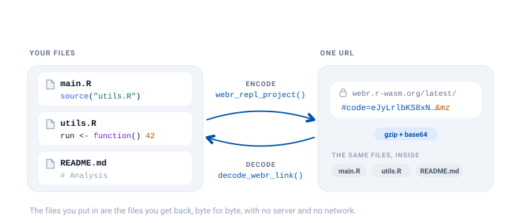

```{=html}
<style>
.ll-fig{display:block;margin:1.5rem auto;max-width:100%;height:auto}
.ll-dark{display:none}
@media (prefers-color-scheme:dark){.ll-light{display:none}.ll-dark{display:block}}
[data-bs-theme=light] .ll-light{display:block}
[data-bs-theme=light] .ll-dark{display:none}
[data-bs-theme=dark] .ll-light{display:none}
[data-bs-theme=dark] .ll-dark{display:block}
</style>
```

```{r setup}
library(livelink)
```

A livelink URL is not a pointer to a file on a server. The files *are* the URL --
compressed, encoded, and carried in the fragment after `#`. Nothing is uploaded
anywhere, which is what makes these links work offline and forever.

That has a useful consequence: any link can be turned back into the files it came
from, by anyone, with no network access.

{.ll-fig .ll-light}
{.ll-fig .ll-dark aria-hidden="true"}

## Look before you leap

Someone sends you a link. Before you let it write anything to your disk, you can
inspect it.

`preview_webr_link()` decodes the URL in memory and tells you what is inside,
without creating a single file.

```{r}
url <- as.character(webr_repl_link("hist(rnorm(100))", filename = "plot.R"))

preview <- preview_webr_link(url)
preview
```

The preview object carries the details, so you can query it rather than read it:

```{r}
preview$total_files
preview$files_data[[1]]$name
```

To see the actual code, ask for it:

```{r}
print(preview, show_content = TRUE)
```

This is the honest way to open a link from a stranger. You get to read the code
before you decide whether to run it.

## Extracting the files

Once you are satisfied, `decode_webr_link()` writes the files out.

```{r}
out <- file.path(tempdir(), "recovered")

result <- decode_webr_link(url, output_dir = out)
result
```

By default it writes into a subdirectory of your session's temporary directory, so a
stray call cannot litter your project. Pass `output_dir` when you want the files
somewhere permanent:

```{r}
#| eval: false
decode_webr_link(url, output_dir = "~/analysis", create_subdir = FALSE)
```

`create_subdir = FALSE` puts the files directly in `output_dir` instead of nesting
them under a hash-named folder.

Existing files are never clobbered silently. If a file is already there, it is
skipped and reported:

```{r}
decode_webr_link(url, output_dir = out)
```

Pass `overwrite = TRUE` when replacing them is what you actually want.

## The round trip is lossless

What goes in comes back out, byte for byte, including multi-file projects and
non-ASCII text.

```{r}
project <- list(
  "main.R"    = "source('utils.R')\nrun()",
  "utils.R"   = "run <- function() 42",
  "README.md" = "# Analysis\n\nWith an accent: café"
)

link <- webr_repl_project(project)

recovered_dir <- file.path(tempdir(), "roundtrip")
invisible(decode_webr_link(as.character(link), output_dir = recovered_dir))

files <- list.files(recovered_dir, recursive = TRUE, full.names = TRUE)
recovered <- setNames(
  lapply(files, function(f) paste(readLines(f, warn = FALSE), collapse = "\n")),
  basename(files)
)

identical(recovered[sort(names(recovered))], project[sort(names(project))])
```

## Shinylive links decode too

The same two functions exist for Shiny apps, and they work the same way.

```{r}
app_url <- as.character(shinylive_r_link("library(shiny)\nshinyApp(fluidPage(), function(i, o) {})"))

preview_shinylive_link(app_url)
```

```{r}
decode_shinylive_link(app_url, output_dir = file.path(tempdir(), "app"))
```

Python apps are no different. `preview_shinylive_link()` reports the engine, so you
can tell what you are looking at before you extract it:

```{r}
py_url <- as.character(shinylive_py_link("from shiny import App, ui"))

preview_shinylive_link(py_url)$engine
```

## Many links at once

Both decoders accept a vector of URLs and return a batch object. This is the useful
shape for grading a stack of student submissions, or auditing a set of links from a
course page.

```{r}
urls <- c(
  as.character(webr_repl_link("plot(1:10)", filename = "one.R")),
  as.character(webr_repl_link("hist(rnorm(50))", filename = "two.R"))
)

batch <- decode_webr_link(urls, output_dir = file.path(tempdir(), "batch"))
batch
```

Each URL gets its own subdirectory, so submissions cannot overwrite one another.

## Reading links livelink did not create

webR's own share dialog encodes files with **msgpack**, not JSON, and livelink writes
JSON. The flags at the end of a URL say which is which. `jz` is JSON + gzip,
`mz` is msgpack + gzip, and `a` means autorun.

livelink reads all of them. A link produced by webR itself decodes exactly like one
produced here, and you do not have to know or care which tool made it.

## Getting just the URL

Every object livelink returns (links, projects, previews, decoded results) answers
to `repl_urls()`:

```{r}
repl_urls(preview)
repl_urls(batch)
```

which is handy when you want to write links out to a file, or drop them into a
document, without unpicking the object.
