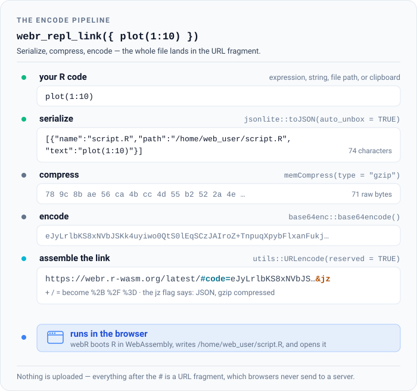
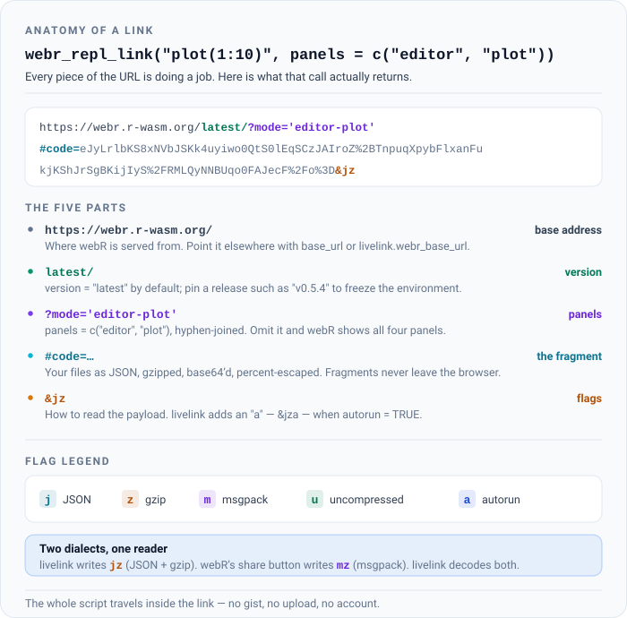

```{r setup}
library(livelink)
```

## The idea

Sharing R code usually means asking someone to install something. livelink asks
nothing: it packs your code *into a URL*, and the recipient clicks it and is looking
at a running R session in their browser.

There is no server and no upload. The code is compressed and encoded into the part of
the URL after the `#`, which browsers never send anywhere. The link is the payload.

{fig-alt="The call webr_repl_link({ plot(1:10) }) becomes a webR URL whose #code fragment carries the whole script, and the link opens a running R session showing the plot. Everything after the hash is a URL fragment, which browsers never send to a server."}

The steps in between — serialize to JSON, gzip, base64, percent-escape — are worth
seeing once:

{fig-alt="A pipeline diagram. R code is serialized to JSON, compressed with gzip, encoded as base64, and placed in the fragment of a URL after a hash symbol. Opening the URL runs the code in the browser."}

Two destinations are supported:

- **[webR](https://docs.r-wasm.org/webr/latest/)** -- a full R console and editor in the browser.
- **[Shinylive](https://shiny.posit.co/py/get-started/shinylive.html)** -- Shiny apps, R or Python, with no server.

## Your first link

Pass some code. Get a link.

```{r}
webr_repl_link("plot(1:10)")
```

Print the object to see the URL, or use `as.character()` to get the bare string.

You can skip the quotes entirely and hand it a braced expression, which is easier to
write and lets your editor highlight the code:

```{r}
webr_repl_link({
  data(mtcars)
  plot(mtcars$mpg, mtcars$wt)
})
```

::: {.callout-note}
## Comments and expression input

Expression input reconstructs your code from R's *source references*. Those exist in
an interactive session, but not when a document is knitted -- so comments inside
`{ }` are dropped from the link when this vignette is rendered.

If your code has comments worth keeping, pass it as a string or a file path, or use
the `livelink` chunk engine described below. See `?webr_repl_link`.
:::

You can also point at a file:

```{r}
script <- tempfile(fileext = ".R")
writeLines(c("# fit a model", "lm(mpg ~ wt, data = mtcars)"), script)

webr_repl_link(script)
```

...or, in an interactive session, copy code to your clipboard and call
`webr_repl_link()` with no arguments at all.

## Making it run on arrival

By default the recipient sees your code, ready to run. Set `autorun = TRUE` and it
runs the moment the page opens -- right for a demo, wrong for an exercise.

```{r}
webr_repl_link("hist(rnorm(1000))", autorun = TRUE)
```

## Choosing what they see

webR shows an editor, a plot pane, a file browser, and a terminal. `panels` picks
which of them appear.

```{r}
webr_repl_link("plot(1:10)", panels = c("editor", "plot"))
```

## A Shiny app instead

`shinylive_r_link()` does the same for a Shiny application.

```{r}
app <- "
library(shiny)
ui <- fluidPage(
  sliderInput('bins', 'Bins:', 1, 50, 30),
  plotOutput('hist')
)
server <- function(input, output) {
  output$hist <- renderPlot(hist(faithful$waiting, breaks = input$bins))
}
shinyApp(ui, server)
"

shinylive_r_link(app, mode = "app")
```

`mode = "app"` shows the running application. `mode = "editor"` shows the code beside
it, which is what you want when the point is to teach. Python apps work the same way
through `shinylive_py_link()`.

## What a link actually looks like

Nothing here is magic, and the URL is readable if you know where to look.

{fig-alt="A labelled webR URL, broken into parts: the base address, the webR version, a mode parameter listing which panels to show, a code fragment containing the base64-encoded files, and trailing flags indicating the encoding used."}

The flags at the end say how the payload was encoded: `j` for JSON, `z` for gzip,
`m` for msgpack, `u` for uncompressed, `a` for autorun. livelink writes `jz`; webR's
own share button writes `mz`. livelink reads both.

## Going the other way

Because the files live in the URL, any link can be turned back into files -- with no
network access and no cooperation from a server.

```{r}
url <- as.character(webr_repl_link("plot(1:10)"))

preview_webr_link(url)
```

`preview_webr_link()` inspects a link *without writing anything*, which is the
sensible way to open a link someone sent you. `decode_webr_link()` extracts the files
once you have decided you trust them.

## Links inside a document

If you write in Quarto or R Markdown, you do not need to build a link in one chunk and
paste the URL into another. livelink registers a chunk engine:

````
```{livelink}
#| autorun: true
# Load the data
data(mtcars)
plot(mtcars$mpg, mtcars$wt)
```
````

The chunk is displayed as code *and* rendered as a link that runs it. Comments survive,
which they do not when a `{ }` expression is knitted. See `?use_livelink_engine()`.

## Where to next

- **Multi-file projects and Shiny apps** -- projects, apps in R and Python, and batch-processing directories.
- **Decoding and previewing links** -- turning a link back into files, and inspecting one before you trust it.
- **Teaching with livelink** -- exercise and solution pairs, whole course directories, and embedding links in notes.
