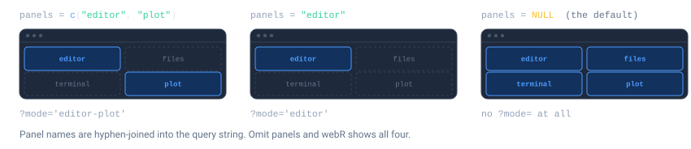
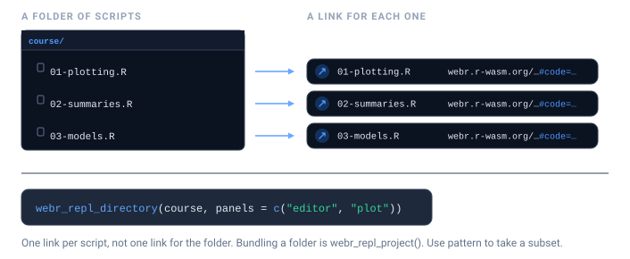
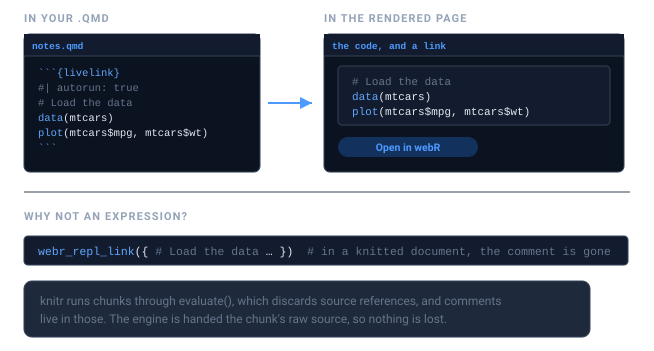

```{=html}
<style>
.ll-fig{display:block;margin:1.5rem auto;max-width:100%;height:auto}
.ll-dark{display:none}
@media (prefers-color-scheme:dark){.ll-light{display:none}.ll-dark{display:block}}
[data-bs-theme=light] .ll-light{display:block}
[data-bs-theme=light] .ll-dark{display:none}
[data-bs-theme=dark] .ll-light{display:none}
[data-bs-theme=dark] .ll-dark{display:block}
</style>
```

```{r setup}
library(livelink)
```

The hardest part of teaching R is not R. It is the twenty minutes at the start of a
workshop spent installing R, then RStudio, then a package that fails to compile on
one student's laptop.

livelink sidesteps that. A link opens a working R session in the browser, with your
code already in the editor. Nothing to install, nothing to configure, and it works on
a school Chromebook.

## Exercise and solution pairs

`webr_repl_exercise()` is built for the most common teaching shape: give students a
scaffold with the answer removed, and keep the worked solution behind a second link.

{.ll-fig .ll-light}
{.ll-fig .ll-dark aria-hidden="true"}

```{r}
exercise <- "
# Exercise: what is the mean mpg of the cars in mtcars?
# Replace the 0 below with your answer.

mean_mpg <- 0
print(mean_mpg)
"

solution <- "
# Solution
mean_mpg <- mean(mtcars$mpg)
print(mean_mpg)
"

links <- webr_repl_exercise(exercise, solution, "mean_mpg")
links
```

The two links differ in one deliberate way: the solution **autoruns** and the exercise
does not. Students landing on the exercise see the code sitting there waiting for
them. Students landing on the solution see the answer already computed.

```{r}
links$exercise$autorun
links$solution$autorun
```

Hand out the exercise link in class; hold the solution link back until afterwards, or
put it behind a collapsed callout in your notes.

```{r}
repl_urls(links)
```

## Choosing what students see

A full webR session shows an editor, a plot pane, a file browser, and a terminal. For
a first-year class that is a lot of surface area, and the terminal in particular
invites students to wander off.

`panels` controls which of them appear.

{.ll-fig .ll-light}
{.ll-fig .ll-dark aria-hidden="true"}

```{r}
# A focused exercise: just write code and see the plot
webr_repl_link("plot(1:10)", panels = c("editor", "plot"))
```

```{r}
#| eval: false
# The full environment, for a project week
webr_repl_link(code, panels = c("editor", "plot", "files", "terminal"))
```

For a lecture demo, where students should see the *result* and not the machinery,
combine `autorun` with a plot-only view:

```{r}
webr_repl_link(
  "hist(rnorm(1000), col = 'steelblue', main = 'The central limit theorem, again')",
  autorun = TRUE,
  panels  = "plot"
)
```

Only `.R` files can autorun. Ask for it on something else and livelink tells you
rather than quietly producing a link that does nothing:

```{r}
#| error: true
webr_repl_link("some data", filename = "data.csv", autorun = TRUE)
```

## A whole folder of scripts

Course material tends to live as a directory of scripts. `webr_repl_directory()`
turns each one into its own link in a single call.

{.ll-fig .ll-light}
{.ll-fig .ll-dark aria-hidden="true"}

```{r}
# A small course directory
course <- file.path(tempdir(), "course")
dir.create(course, showWarnings = FALSE)
writeLines("plot(1:10)",           file.path(course, "01-plotting.R"))
writeLines("mean(mtcars$mpg)",     file.path(course, "02-summaries.R"))
writeLines("lm(mpg ~ wt, mtcars)", file.path(course, "03-models.R"))

links <- webr_repl_directory(course, panels = c("editor", "plot"))
links
```

The result is named by file, so you can drop it straight into a table of contents:

```{r}
urls <- repl_urls(links)
cat(sprintf("- [%s](%s)", names(urls), urls), sep = "\n")
```

Use `pattern` to pick out a subset -- exercises but not solutions, say:

```{r}
webr_repl_directory(course, pattern = "^0[12]")
```

## Embedding links in your notes

If you write course notes in Quarto or R Markdown, you do not have to build the link
in one chunk and paste the URL into another. livelink plugs into knitr, so a chunk can
carry its own link.

{.ll-fig .ll-light}
{.ll-fig .ll-dark aria-hidden="true"}

There are two ways in, and the choice comes down to one question: **should the code
also run in your notes?**

### The chunk hook — output *and* a link

Add `livelink: true` to an ordinary `r` chunk. It runs as it always did — the plot
appears in your notes — and a link is added underneath.

````
```{{r}}
#| livelink: true
#| autorun: true
# Load the data
data(mtcars)
plot(mtcars$mpg, mtcars$wt)   # a comment students will actually see
```
````

That is a real chunk, and here it is running in this very vignette. The plot below is
rendered by R, here; the link beneath it opens the same code in the browser:

```{r}
#| livelink: true
#| autorun: true
#| panels: ["editor", "plot"]
# Load the data
data(mtcars)
plot(mtcars$mpg, mtcars$wt)   # a comment students will actually see
```

This is usually what you want for teaching notes. Students read the result *and* get
to go and poke at it.

### The engine — a link, and no execution

Sometimes the code must not run in your notes: a Shiny app, something needing a
package you have not installed, something slow. Then use a ```` ```{livelink} ````
chunk. The code is shown, a link is produced, and nothing is executed:

````
```{{livelink}}
#| engine.target: shinylive-r
#| mode: app
library(shiny)
shinyApp(fluidPage(sliderInput("n", "n", 1, 100, 50)), function(input, output) {})
```
````

### Why not a braced expression?

Follow either link and the comments are still there. They would not be if you had
written `webr_repl_link({ ... })`: knitr renders chunks through `evaluate()`, which
discards the source references that comments live in. Both the hook and the engine are
handed the chunk's raw source, so nothing is lost — exactly where a teaching example
needs it most.

Chunk options map onto the arguments you already know:

````
```{{r}}
#| livelink: true
#| panels: ["editor", "plot"]
#| link.text: "Try it yourself"
mean(mtcars$mpg)
```
````

and the target can be named directly, when a REPL is not what you want:

````
```{{r}}
#| livelink: shinylive-r
#| mode: app
#| eval: false
library(shiny)
shinyApp(fluidPage(), function(input, output) {})
```
````

## Collecting work back in

Students send you links. `decode_webr_link()` accepts a vector of them and writes each
into its own directory, so a stack of submissions becomes a folder you can grade.

```{r}
submissions <- c(
  as.character(webr_repl_link("mean(mtcars$mpg)",   filename = "student_a.R")),
  as.character(webr_repl_link("median(mtcars$mpg)", filename = "student_b.R"))
)

decode_webr_link(submissions, output_dir = file.path(tempdir(), "submissions"))
```

If you would rather read the code than write it to disk, `preview_webr_link()` shows
you a submission without touching your filesystem at all -- which is the safer default
when the code came from someone else.
