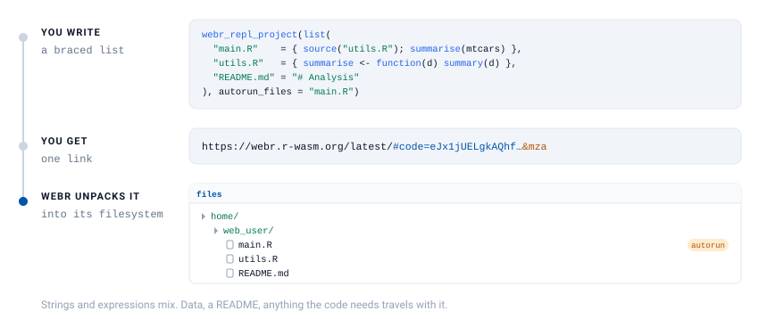
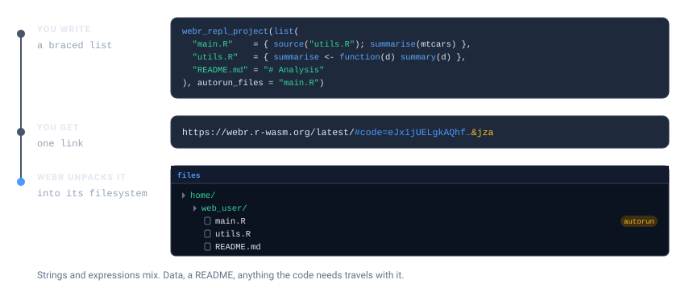
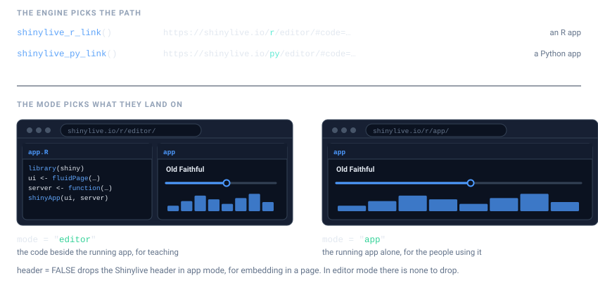

```{=html}
<style>
.ll-fig{display:block;margin:1.5rem auto;max-width:100%;height:auto}
.ll-dark{display:none}
@media (prefers-color-scheme:dark){.ll-light{display:none}.ll-dark{display:block}}
[data-bs-theme=light] .ll-light{display:block}
[data-bs-theme=light] .ll-dark{display:none}
[data-bs-theme=dark] .ll-light{display:none}
[data-bs-theme=dark] .ll-dark{display:block}
</style>
```

```{r setup}
#| include: false
library(livelink)
```

Real work is rarely one file. A script sources a helper, an app is split across
`ui.R` and `server.R`, an analysis needs its data. All of it fits in one link.

This article covers webR projects, Shiny apps in R and Python, and turning a whole
directory into links.

# webR projects

`webr_repl_project()` packs several files into a single link. webR unpacks them into
its filesystem, so `source("utils.R")` finds `utils.R` exactly where it expects it.

{.ll-fig .ll-light}
{.ll-fig .ll-dark aria-hidden="true"}

## Describing the files

Two input shapes, and you can use whichever is closer to hand.

A **named list**, where the names become the filenames. Write each file as R, in
braces. No escaped newlines, no fighting with quotes, and your editor keeps
highlighting it:

```{r}
webr_repl_project(list(
  "main.R"    = { source("utils.R"); summarise(mtcars) },
  "utils.R"   = { summarise <- function(d) summary(d) },
  "README.md" = "# Analysis\n\nRun main.R to start."
))
```

Non-R files stay strings, and the two forms mix freely, since a project is usually code
*and* something else.

::: {.callout-important}
## Write the list inside the call

The braces only work when the list is written *in* the call. `list()` is an ordinary
function, so if you assign it to a variable first, R evaluates its arguments. The
block runs, right there, and livelink never sees the source:

```r
# WRONG: the block runs now, and actually tries to source("utils.R")
project <- list("main.R" = { source("utils.R"); summarise(mtcars) })
webr_repl_project(project)

# RIGHT: written in the call, the block is captured and never run
webr_repl_project(list("main.R" = { source("utils.R"); summarise(mtcars) }))
```

livelink notices the first case and stops with an error rather than encoding whatever
the block happened to return. A list of *strings* in a variable is fine, of course.
That is the older form, and it still works.
:::

Because the blocks are captured rather than evaluated, an assignment inside one leaves
nothing behind in your session. `{ summarise <- function(d) summary(d) }` defines
nothing here. It is source to ship, not code to run.

Two caveats carry over from single-file expressions. Comments inside `{ }` survive
interactively but not in a knitted document, and a `library()` call inside a block is
visible to `R CMD check`, which will report that package as an undeclared dependency
of *yours*. Use a string for code that loads packages.

When a project has to be reused across several calls, as it is through the rest of
this section, keep it as a list of **strings** in a variable. A list of strings is a
plain value, so it assigns without surprises:

```{r}
project <- list(
  "main.R"    = "source('utils.R')\nsummarise(mtcars)",
  "utils.R"   = "summarise <- function(d) summary(d)",
  "README.md" = "# Analysis\n\nRun main.R to start."
)

webr_repl_project(project)
```

A **vector of file paths**, when the code is already on disk:

```{r}
dir <- file.path(tempdir(), "project")
dir.create(dir, showWarnings = FALSE)
writeLines("source('utils.R')",  file.path(dir, "main.R"))
writeLines("f <- function() 42", file.path(dir, "utils.R"))

webr_repl_project(c(file.path(dir, "main.R"), file.path(dir, "utils.R")))
```

Files are read and named by their basename, so the paths on your machine never leave
it.

## Running something on arrival

`autorun_files` names the files to execute when the link opens. The link then carries
webR's `a` flag, which is what actually triggers the run:

```{r}
link <- webr_repl_project(project, autorun_files = "main.R")

preview_webr_link(as.character(link))$autorun_files
```

Pass `"all"` to run every R file in the project:

```{r}
webr_repl_project(project, autorun_files = "all")
```

Naming a file that is not in the project is an error, rather than a link that quietly
does nothing:

```{r}
#| error: true
webr_repl_project(project, autorun_files = "nonexistent.R")
```

Only `.R` files can autorun. Listing a `.csv` is harmless, and simply is not run.

## Where the files land

By default everything is placed in `/home/web_user/`, which is webR's working
directory, so relative paths in your code just work. `base_path` moves them:

```{r}
webr_repl_project(project, base_path = "/home/web_user/analysis/")
```

Move them and relative `source()` calls have to move with them, so leave this alone
unless you have a reason.

# Shiny apps

{.ll-fig .ll-light}
{.ll-fig .ll-dark aria-hidden="true"}

Write the app as a braced expression, exactly as you would write it anywhere. No
quotes around the whole thing, no escaped newlines, and your editor keeps highlighting
the code:

```{r}
#| eval: false
shinylive_r_link({
  library(shiny)

  ui <- fluidPage(
    titlePanel("Old Faithful"),
    sliderInput("bins", "Bins:", 1, 50, 30),
    plotOutput("hist")
  )

  server <- function(input, output) {
    output$hist <- renderPlot({
      hist(faithful$waiting, breaks = input$bins, col = "steelblue")
    })
  }

  shinyApp(ui, server)
})
```

That is real, working code. It is marked `eval: false` here for one narrow reason,
which does not apply to your own documents.

::: {.callout-note}
## Why that chunk is not run

Only to keep this package's vignette honest about its dependencies. `R CMD check`
reads the live code in a vignette and, finding `library(shiny)` in a braced
expression, would decide livelink depends on shiny. It does not. Marking the chunk
`eval: false` keeps that call out of the scanned code.

Your own course notes are not a package under check, so there is no such constraint.
Write the app as an expression and let it run.
:::

When you want the link built and inspected here, a string sidesteps the scan, so this
vignette can execute it. A bare string becomes `app.R`:

```{r}
app <- "library(shiny)\nshinyApp(fluidPage(), function(input, output) {})"

shinylive_r_link(app)
```

For an app split across files, the same choice applies. Write each file in braces:

```{r}
#| eval: false
shinylive_r_link(list(
  "app.R"    = { library(shiny); source("ui.R"); source("server.R"); shinyApp(ui, server) },
  "ui.R"     = { ui <- fluidPage(titlePanel("Split app")) },
  "server.R" = { server <- function(input, output) {} }
))
```

## Editor or app?

`mode` decides what a visitor lands on.

```{r}
# code and app side by side -- for teaching and review
shinylive_r_link(app, mode = "editor")
```

```{r}
# the running application only -- for the people who just want to use it
shinylive_r_link(app, mode = "app")
```

In `app` mode you can also drop the Shinylive header, which is what you want when the
app is going into an `<iframe>` on someone else's page:

```{r}
shinylive_r_link(app, mode = "app", header = FALSE)
```

`header` does nothing in `editor` mode, where there is no header to hide.

::: {.callout-note}
## `mode` is not `panels`

Shinylive has two display *modes*, `"editor"` and `"app"`. webR has four *panels* you
can show or hide. They are different arguments because they are different ideas: one
picks a layout, the other picks which parts of a layout appear.
:::

## Python

Python apps work the same way, and a bare string becomes `app.py`:

```{r}
py_app <- "
from shiny import App, render, ui

app_ui = ui.page_fluid(
    ui.h2('Hello from Python'),
    ui.output_text('greeting'),
)

def server(input, output, session):
    @render.text
    def greeting():
        return 'Running in the browser, no server required.'

app = App(app_ui, server)
"

shinylive_py_link(py_app, mode = "app")
```

The engine is in the URL, `shinylive.io/r/` versus `shinylive.io/py/`, so a link
carries its own language with it.

`shinylive_project()` is the same thing with the engine named explicitly, which is
useful when the engine is a variable rather than a decision you already made:

```{r}
shinylive_project(
  list("app.py" = py_app, "utils.py" = "def helper():\n    return 42"),
  engine = "python"
)
```

# A directory at a time

Each Shiny app in its own folder is the usual layout, and `shinylive_directory()`
turns the lot into links in one pass:

```{r}
apps <- file.path(tempdir(), "apps")
dir.create(file.path(apps, "histogram"), recursive = TRUE, showWarnings = FALSE)
dir.create(file.path(apps, "scatter"),   recursive = TRUE, showWarnings = FALSE)
writeLines(app, file.path(apps, "histogram", "app.R"))
writeLines(app, file.path(apps, "scatter",   "app.R"))

links <- shinylive_directory(apps, engine = "r", mode = "app")

repl_urls(links)
```

Every subdirectory holding an `app.R` (or `app.py`, for Python) becomes one link,
named after the folder. Helpers, data and CSS in that folder are bundled in with it.
Binary files are skipped with a warning, because a link is the wrong place for them.

A directory with no apps in it warns and hands back an empty result, rather than
failing:

```{r}
empty <- file.path(tempdir(), "no-apps")
dir.create(empty, showWarnings = FALSE)

shinylive_directory(empty, engine = "r")
```

`webr_repl_directory()` is the webR counterpart, and by default it works the other way
round: it gives each R script in a directory *its own* link, rather than bundling a
folder into one. That suits a folder of course scripts, and
[Teaching with livelink](teaching.html) puts it to work.

When you do want the whole directory in a single link, pass `single_link = TRUE`. The
files are bundled exactly as `webr_repl_project()` would bundle them, and you get one
`webr_project` back instead of a directory of links:

```{r}
scripts <- file.path(tempdir(), "scripts")
dir.create(scripts, showWarnings = FALSE)
writeLines("source('utils.R')", file.path(scripts, "main.R"))
writeLines("f <- function() 42", file.path(scripts, "utils.R"))

webr_repl_directory(scripts, single_link = TRUE, panels = c("editor", "plot"))
```

With `autorun = TRUE` alongside it, every R file in the bundle runs on arrival.

# How big can a link get?

The files travel *inside* the URL, so the ceiling is whatever a browser accepts in a
URL. Current browsers handle tens of thousands of characters, which is a lot of R.

The payload is gzipped before it is encoded, and source code compresses well. Real R
source, rather than a toy example:

```{r}
src <- paste(
  unlist(lapply(c("lm", "glm", "aov"), function(f) {
    paste(deparse(get(f, envir = asNamespace("stats"))), collapse = "\n")
  })),
  collapse = "\n\n"
)

url <- as.character(webr_repl_link(src, filename = "stats.R"))

c(source_chars = nchar(src), url_chars = nchar(url))
```

The link comes out *smaller than the code it carries*, because gzip more than pays for
what base64 costs.

Binary data is the case that does not work: it does not compress, and base64 inflates
it by a third. Do not put a PNG in a link. Have the code fetch it, or point at it.
